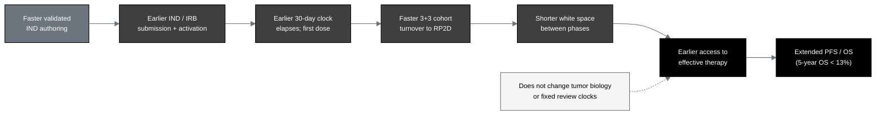

## Figure 10. The patient time-saved cascade from a faster IND

**Caption.** The patient time-saved cascade. Faster validated authoring advances
each step from IND submission to first dose, then through faster 3+3 cohort
turnover to the recommended Phase 2 dose, shortening the white space between phases
and, for this low-survival population (five-year overall survival under 13
percent), extending progression-free and overall survival, without changing tumor
biology or the fixed regulatory review clocks.

**Role in the IND.** Renders in §4.1 (Rationale) and §4.6 (Drug Related Risks) as
the patient-level benefit argument supporting the favorable benefit-risk balance.

**Source files.**
`trial-documents/final-paper/publication/sections/sec-05-discussion.tex` (Figure
24, the patient time-saved cascade, adapted in context);
`trial-protocol/final-protocol/publication/sections/sec-02-introduction.tex`
(PDAC survival baseline).
