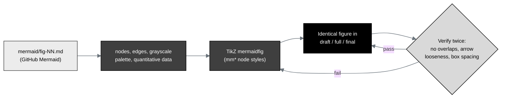

## Figure 11. Figure grounding: each Mermaid source reproduced as an identical TikZ figure

**Caption.** Figure grounding. Each Mermaid source in `mermaid/` is reproduced as a
TikZ `mermaidfig` of the same complexity (the same nodes, edges, grayscale palette,
and quantitative data), then verified twice for text-box and arrow overlaps, for
the specified arrow looseness, and for proper box spacing, before it appears
identically in the draft, full, and final stages.

**Role in the IND.** Renders in §11 (Relevant Information) as the
Mermaid-to-LaTeX translation and verification discipline that keeps every figure
identical from Python to LaTeX.

**Source files.**
`trial-documents/final-paper/publication/sections/sec-04-results.tex` (Figure 15,
figure grounding, adapted in context);
`trial-ind/draft-ind/indstyle.sty` (the `mm*` node styles and `mermaidfig`
environment).
