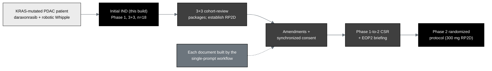

## Figure 12. The real-world daraxonrasib PDAC document thread

**Caption.** The real-world daraxonrasib PDAC document thread, from the
KRAS-mutated patient and the intervention through this initial Phase 1 IND, the
3+3 cohort-review packages that establish the recommended Phase 2 dose, the
amendments with synchronized consent, and the Phase 1-to-2 clinical study report
and end-of-Phase-2 briefing, to the Phase 2 randomized protocol at the 300 mg
recommended Phase 2 dose, each document built by the single-prompt workflow.

**Role in the IND.** Renders in the Introduction (§3.2 Summary of Previous Human
Experience) and §4.4 (Description of First Year Trials), threading the IND into the
real program.

**Source files.**
`trial-documents/final-paper/publication/sections/sec-05-discussion.tex` (Figure
23, the daraxonrasib document thread, adapted in context);
`trial-protocol/final-protocol/publication/sections/sec-04-design.tex` (the 3+3 to
RP2D path).
