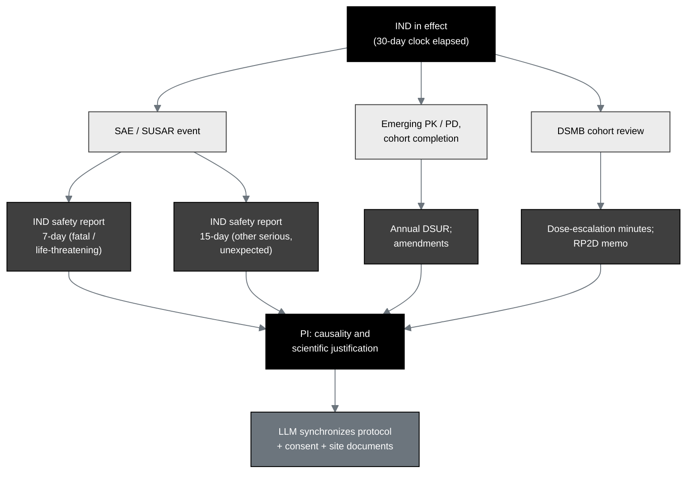

## Figure 13. Post-submission IND maintenance authoring

**Caption.** Post-submission authoring once the IND is in effect is driven by
safety data: IND safety reports on the 7-day (fatal or life-threatening suspected
adverse reaction) and 15-day (other serious and unexpected) clocks, the annual
DSUR, amendments, and dose-escalation minutes, with the principal investigator
assessing causality and scientific justification and the LLM synchronizing the
protocol, consent, and site documents so the whole suite stays internally
consistent.

**Role in the IND.** Renders in §9 (Previous Human Experience) and §10 (Additional
Information), showing the maintenance burden the same method carries after
submission.

**Source files.**
`trial-documents/final-paper/publication/sections/sec-03-methods.tex` (Figure 11,
after-trial authoring, adapted in context to post-submission IND maintenance);
`trial-protocol/final-protocol/publication/sections/sec-10-oversight.tex` (the
7 / 15-day clocks and DSMB cadence).
