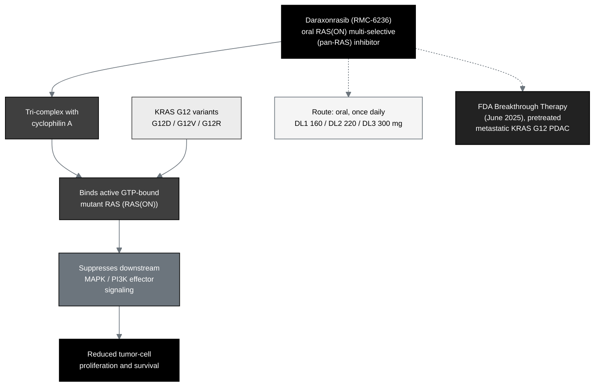

## Figure 14. Daraxonrasib mechanism and pharmacological class

**Caption.** Daraxonrasib (RMC-6236) is an oral RAS(ON) multi-selective (pan-RAS)
small-molecule inhibitor. It forms a tri-complex with cyclophilin A and binds the
active, guanosine-triphosphate-bound state of mutant RAS, including the KRAS G12
variants (G12D, G12V, G12R) that define the trial population, suppressing
downstream MAPK and PI3K effector signaling and reducing tumor-cell proliferation
and survival. It is dosed orally once daily at DL1 160 mg, DL2 220 mg, and DL3 300
mg, and holds FDA Breakthrough Therapy designation (June 2025) for previously
treated metastatic KRAS G12 PDAC.

**Role in the IND.** Renders in §3.1.1 (Name of Drug and Active Ingredients),
§3.1.2 (Pharmacological Class), and §3.1.3 (Structural Formula).

**Source files.**
`trial-protocol/final-protocol/publication/sections/sec-06-intervention.tex`
(mechanism, class, and dosing);
`trial-ind/inputs/references.bib` (`daraxwhipple`, `onpremwhippl`).
