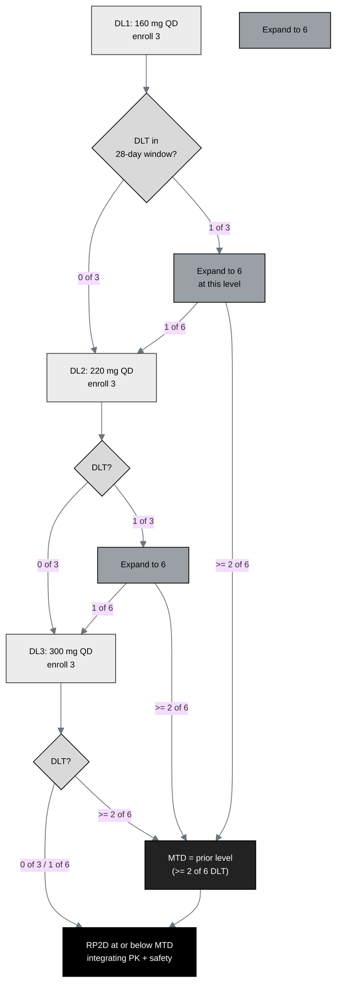

## Figure 15. The 3+3 dose-escalation decision automaton

**Caption.** The standard 3+3 dose-escalation automaton across the three
daraxonrasib dose levels (DL1 160 mg, DL2 220 mg, DL3 300 mg once daily). Three
participants enroll at each level; with no dose-limiting toxicity in the 28-day
window the cohort escalates, with one of three it expands to six, and two or more
of six fixes the maximum tolerated dose at the prior level. The recommended Phase 2
dose is selected at or below the maximum tolerated dose, integrating pharmacokinetic
and safety data. The design maximum is three levels times six, up to 18 treated.

**Role in the IND.** Renders in §4.3 (General Approach for Evaluation of Treatment)
and §4.4 (Description of First Year Trials).

**Source files.**
`trial-protocol/final-protocol/publication/sections/sec-04-design.tex` (the 3+3
rule and dose levels, presented here as a new decision automaton);
`trial-protocol/final-protocol/publication/sections/sec-09-statistics.tex` (MTD /
RP2D definitions).
