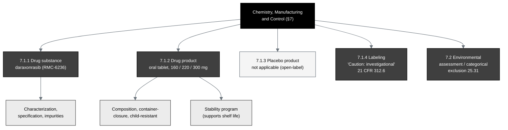

## Figure 16. Chemistry, Manufacturing and Control information architecture

**Caption.** The Chemistry, Manufacturing and Control information architecture for
§7. The drug substance (daraxonrasib, RMC-6236) is described by characterization,
specification, and impurity controls; the drug product is the oral tablet at the
160, 220, and 300 mg strengths with its composition and child-resistant,
light-protective container-closure under 21 CFR §312.6, supported by a stability
program; the placebo product is not applicable for this open-label study; labeling
carries the investigational caution statement; and an environmental assessment or
categorical exclusion under 21 CFR §25.31 is provided.

**Role in the IND.** Renders in §7 (Chemistry, Manufacturing and Control
Information), §7.1.1 to §7.2.

**Source files.**
`trial-ind/inputs/ReGARDD_IND_Template.docx` (the §7 CMC content map);
`trial-protocol/final-protocol/publication/sections/sec-06-intervention.tex`
(formulation and packaging).
