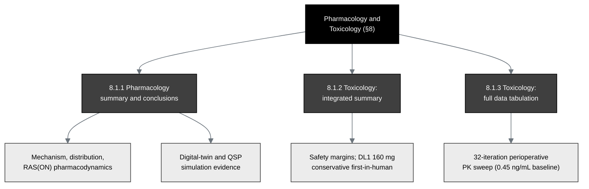

## Figure 17. Pharmacology and toxicology integrated-summary structure

**Caption.** The pharmacology and toxicology integrated-summary structure for §8.
The pharmacology summary covers the RAS(ON) mechanism, drug distribution, and
pharmacodynamics; the integrated toxicology summary states the safety margins
underpinning the conservative DL1 160 mg first-in-human starting dose; and the full
data tabulation tabulates the supporting studies, here grounded in the author's
digital-twin and quantitative-systems-pharmacology simulation evidence and the
32-iteration perioperative pharmacokinetic sweep (0.45 ng/mL baseline serum trough
at the operative timepoint across all iterations).

**Role in the IND.** Renders in §8 (Pharmacology and Toxicology Information),
§8.1.1 to §8.1.3, and §3.4 (Overview of Preclinical Data).

**Source files.**
`trial-protocol/final-protocol/publication/sections/sec-06-intervention.tex`
(perioperative PK sweep);
`trial-ind/inputs/references.bib` (`qspmetpancre`, `fdadigtwinpc`, `pdacdigtwinp`,
`chatgpt100kp`).
