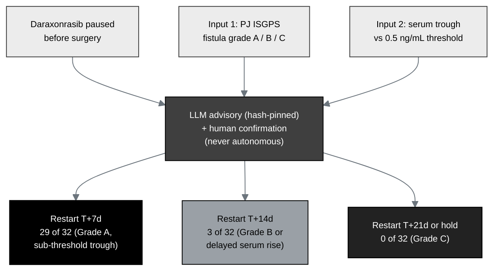

## Figure 18. Perioperative daraxonrasib pause-and-restart advisory

**Caption.** The perioperative daraxonrasib pause-and-restart advisory. The drug is
paused before surgery and the postoperative restart day is set by a hash-pinned,
human-confirmed LLM advisory (never autonomous) from two inputs: the
pancreaticojejunostomy ISGPS fistula grade (A, B, or C) and the serum daraxonrasib
trough relative to a 0.5 ng/mL threshold. In the 32-iteration deterministic sweep
the advisory recommended restart at T+7 days in 29 of 32 iterations (Grade A with
sub-threshold trough), T+14 days in 3 of 32 (Grade B or delayed serum rise), and
T+21 days or continued hold in 0 of 32 (reserved for Grade C).

**Role in the IND.** Renders in §3.1.5 (Route of Administration) and §6.1 (Study
Protocol), specifying the drug-administration decision rule.

**Source files.**
`trial-protocol/final-protocol/publication/sections/sec-06-intervention.tex` (the
advisory inputs, outputs, and the 32-iteration sweep distribution).
