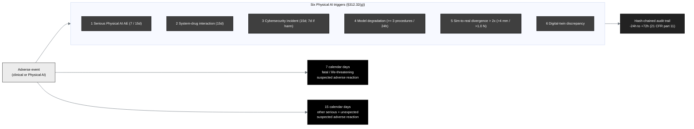

## Figure 19. Safety-reporting clocks and the six Physical AI reporting triggers

**Caption.** The safety-reporting clocks and the six Physical AI reporting
triggers. A fatal or life-threatening suspected adverse reaction is reported within
7 calendar days and any other serious and unexpected suspected adverse reaction
within 15 calendar days (21 CFR §312.32). The six Physical AI triggers of §312.32(g)
are a serious Physical AI adverse event (7 or 15-day), a system-drug interaction
(15-day), a cybersecurity incident (15-day, or 7-day if patient harm is possible),
sustained model degradation (at least 3 consecutive procedures or 24 cumulative
hours), a sim-to-real divergence exceeding twice the validated tolerance (trajectory
over 4 mm or force over 1.0 N), and a digital-twin discrepancy. Each preserves the
hash-chained audit trail from minus 24 to plus 72 hours under 21 CFR part 11.

**Role in the IND.** Renders in §9 (Previous Human Experience) and the safety
narrative of §6.1 (Study Protocol).

**Source files.**
`trial-protocol/final-protocol/publication/sections/sec-08-assessments.tex` (the
7 / 15-day clocks and the six §312.32(g) triggers);
`trial-protocol/final-protocol/publication/sections/sec-10-oversight.tex` (audit
trail).
