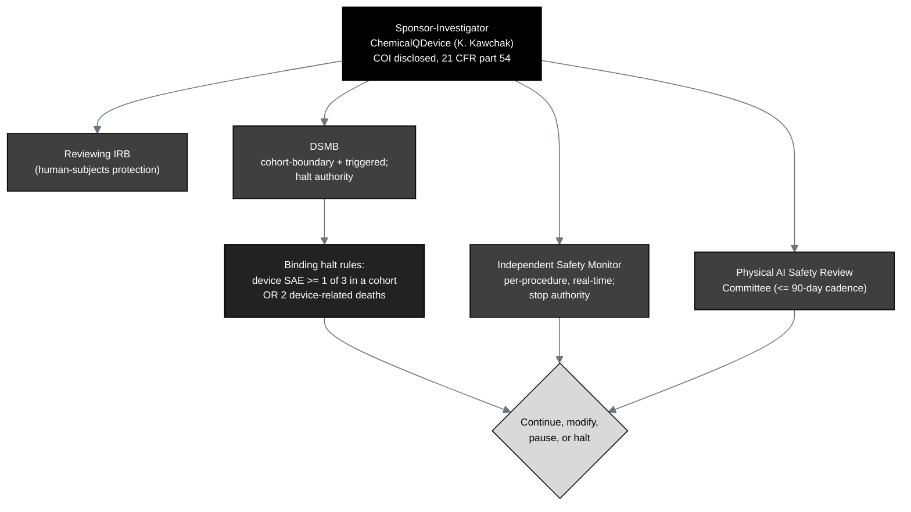

## Figure 20. Study governance and three-tier safety oversight

**Caption.** Study governance and the three-tier safety oversight. The
sponsor-investigator (ChemicalQDevice, Kevin Kawchak, with the conflict of
interest disclosed under 21 CFR part 54) operates under a reviewing IRB and three
independent bodies: the Data Safety Monitoring Board (cohort-boundary and triggered
reviews, with halt authority), the Independent Safety Monitor (per-procedure,
real-time, with stop authority), and the Physical AI Safety Review Committee (a
cadence of 90 days or less). The binding halt rules, a device-related serious
adverse event in at least one of three within a cohort or two device-related deaths
at any point, drive the continue, modify, pause, or halt decision.

**Role in the IND.** Renders in §6.3 (Investigator and Facilities Data) and §10.4
(Other Information).

**Source files.**
`trial-protocol/final-protocol/publication/sections/sec-10-oversight.tex` (the
three-tier oversight and halt rules);
`trial-protocol/final-protocol/publication/sections/sec-09-statistics.tex` (the
binding stopping rules).
