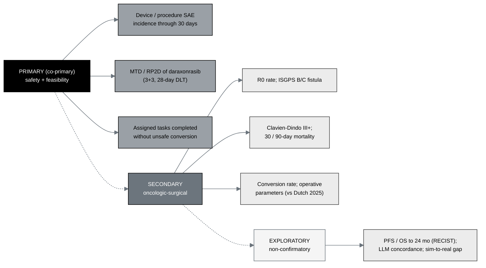

## Figure 21. General Investigational Plan: objectives mapped to endpoints

**Caption.** The objective-to-endpoint hierarchy of the general investigational
plan. Three co-primary objectives (device or procedure serious-adverse-event
incidence through 30 days, the maximum tolerated dose and recommended Phase 2 dose
of daraxonrasib by 3+3 over the 28-day window, and completion of assigned operative
tasks without unsafe conversion) sit above secondary oncologic-surgical quality
endpoints (R0 rate, ISGPS grade B/C fistula, Clavien-Dindo grade III or higher, 30
and 90-day mortality, conversion rate, and operative parameters benchmarked against
the Dutch 2025 robotic cohort) and exploratory, non-confirmatory endpoints
(progression-free and overall survival to 24 months by RECIST, LLM advisory
concordance, and the sim-to-real gap).

**Role in the IND.** Renders in §4.3 (General Approach for Evaluation of Treatment)
and §4.4 (Description of First Year Trials).

**Source files.**
`trial-protocol/final-protocol/publication/sections/sec-03-objectives.tex` (the
objective-to-endpoint hierarchy);
`trial-protocol/final-protocol/publication/sections/sec-08-assessments.tex` (the
endpoint definitions and Dutch 2025 comparators).
