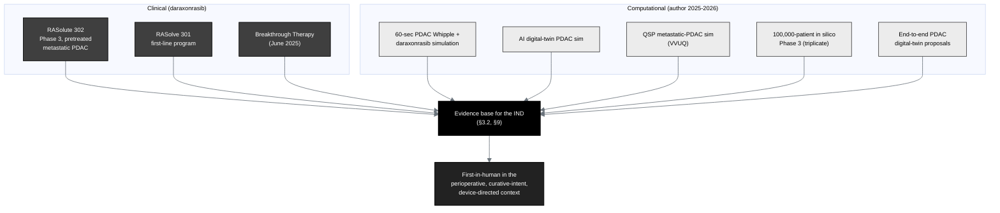

## Figure 22. Previous human experience and the evidence base

**Caption.** The previous human experience and evidence base. Clinically,
daraxonrasib is supported by the RASolute 302 Phase 3 program in previously treated
metastatic PDAC, the RASolve 301 first-line program, and its June 2025 Breakthrough
Therapy designation; computationally, the author's 2025-2026 works supply the
simulation scaffolding (the 60-second PDAC Whipple and daraxonrasib simulation, the
AI digital-twin PDAC simulation, the quantitative-systems-pharmacology metastatic
PDAC simulation with verification, validation and uncertainty quantification, the
100,000-patient in silico Phase 3 triplicate, and the end-to-end PDAC digital-twin
proposals). Daraxonrasib remains first-in-human in this perioperative,
curative-intent, device-directed surgical context.

**Role in the IND.** Renders in §3.2 (Summary of Previous Human Experience) and §9
(Previous Human Experience), §9.1 to §9.3.

**Source files.**
`trial-protocol/final-protocol/publication/sections/sec-02-introduction.tex` (the
clinical and computational evidence);
`trial-ind/inputs/references.bib` (`pdac060s2030`, `fdadigtwinpc`, `qspmetpancre`,
`chatgpt100kp`, `pdacdigtwinp`).
