# trial-phase-2 - Physical AI Pancreatic Whipple + Daraxonrasib Phase 2 Randomized Controlled Trial Protocol (v1.1.0)

[](https://creativecommons.org/licenses/by/4.0/)
[](.)
[](.)
[](.)
[](nih-protocol)
[](final-protocol/publication/sections/sec-09-statistics.tex)
[-6B6B6B.svg)](.)
[](mermaid)
[](final-protocol/publication)
[](final-protocol/publication)
[](../trial-protocol)
[](final-protocol/publication/sections/sec-10-oversight.tex)
[](https://orcid.org/0009-0007-5457-8667)
[](https://doi.org/10.5281/zenodo.xxxxxxxx)
[](../releases.md)

[Publication with Author Edits](https://github.com/kevinkawchak/physical-ai-oncology-trials/tree/main/trial-phase-2/final-protocol/publication) (final-protocol/publication; the paper URL directory). This directory holds the **Phase 2,
Multicenter, Randomized, Controlled Clinical Trial Protocol** for **on-premises
large language model (LLM) directed robotic pancreaticoduodenectomy (the Whipple
procedure) with perioperative daraxonrasib (RMC-6236)** in patients with
KRAS-mutated pancreatic ductal adenocarcinoma (PDAC). It is the randomized
controlled efficacy study that the
[Phase 1 protocol](../trial-protocol) (v1.0.0) explicitly deferred.

The build is driven by the single master prompt in
[`prompts/prompt-protocol.md`](prompts/prompt-protocol.md): **Process A** generated
every sub-prompt under [`sub-prompts/`](sub-prompts), and **Process B** runs those
sub-prompts in order, growing the protocol from Mermaid figures to a draft, a
full, a final, and an author-edited publication LaTeX protocol. Every
distinguishable file is a separate commit pushed in real time.

- **Author:** Kevin Kawchak, CEO ChemicalQDevice
  ([ORCID 0009-0007-5457-8667](https://orcid.org/0009-0007-5457-8667))
- **DOI:** [`10.5281/zenodo.xxxxxxxx`](https://doi.org/10.5281/zenodo.xxxxxxxx)
  (pending deposit) - **Date:** June 23, 2026 - **Protocol version:** v1.1.0 - **Repository release:** v4.1.0

## What this protocol is

The Phase 1 protocol was a single-arm, first-in-human, combined IND/IDE study that
established the daraxonrasib recommended Phase 2 dose (RP2D, 300 mg once daily) and
the feasibility and safety of the on-premises LLM-directed eight-arm robotic
Whipple. With those questions answered, genuine clinical equipoise now exists, so
this Phase 2 protocol randomizes 220 participants 1:1 across eight high-volume
academic centers, powered for a confirmatory progression-free-survival (PFS)
primary endpoint, with a fixed-sequence hierarchy of key secondary endpoints. The
device readiness bar, the simulation evidence, the multicenter governance, and the
data infrastructure are all upgraded from Phase 1.

A distinctive Phase 2 addition is a **Patient-Aligned Co-Investment Facility
(PACIF)**: wealthier individuals connected to cancer patients contribute ring-fenced
capital to raise the trial's success likelihood. A **capital firewall**
structurally prevents any funder from influencing randomization, endpoints,
adjudication, analysis, or publication; capital buys only operational levers
(more sites, more simulation compute, a patient access and equity fund, central
review, and independent oversight), so it raises power, fidelity, retention,
equity, and generalizability without buying the answer.

## Build pipeline (Phase 2 palette)

```mermaid
%%{init: {'theme':'base','themeVariables':{'fontSize':'13px','lineColor':'#6B6B6B'}}}%%
flowchart LR
    MP["Master prompt<br/>prompts/prompt-protocol.md"]:::goal
    S1["Stage 1 mermaid<br/>24 colored figures"]:::light
    S2["Stage 2 draft<br/>bracketed scaffold"]:::light
    S3["Stage 3 full<br/>22 TikZ figures, 11 tables"]:::mid
    S4["Stage 4 final<br/>polished + zip"]:::mid
    PUB["Publication<br/>author edits, paper URL dir"]:::goal
    REL["Release v4.1.0<br/>CHANGELOG + releases + README"]:::goal
    MP --> S1 --> S2 --> S3 --> S4 --> PUB --> REL
    classDef light fill:#F5F5F5,stroke:#800020,stroke-width:1.2px,color:#111111
    classDef mid fill:#6B6B6B,stroke:#111111,stroke-width:1.4px,color:#FFFFFF
    classDef goal fill:#800020,stroke:#000000,stroke-width:1.6px,color:#FFFFFF
```



## Milestone schedule (one pull request, updated as each lands)

| Milestone | Stage | Output directory | Status |
|:--|:--|:--|:--|
| M1 | Bootstrap (Process A) | `prompts/`, `sub-prompts/`, this README, directory READMEs, recolored template | complete |
| M2 | Stage 1 mermaid | [`mermaid/`](mermaid) (24 figures) | complete |
| M3 | Stage 2 draft-protocol | [`draft-protocol/`](draft-protocol) | complete |
| M4 | Stage 3 full-protocol | [`full-protocol/`](full-protocol) (22 TikZ, 11 tables) | complete |
| M5 | Stage 4 final-protocol | [`final-protocol/`](final-protocol) | complete |
| M6 | Publication (paper URL dir) | [`final-protocol/publication/`](final-protocol/publication) | complete |
| M7 | Release (v4.1.0) | root `CHANGELOG.md`, `releases.md`, `README.md` | complete |

## Protocol at a glance

| Element | Value |
|:--|:--|
| Design | Phase 2, multicenter (8 centers), randomized 1:1, parallel-group, controlled, open-label with blinded independent central review (BICR) |
| Arm A (experimental) | Perioperative daraxonrasib at RP2D (300 mg once daily) + on-premises LLM-directed eight-arm robotic Whipple (PancreSpeed II) |
| Arm B (control) | Modified FOLFIRINOX + institutional-standard high-volume pancreaticoduodenectomy |
| Population | KRAS G12 PDAC, ECOG 0-1, resectable / borderline-resectable; n = 220 randomized |
| Primary endpoint | Progression-free survival; HR 0.60; 85 percent power; two-sided alpha 0.05; about 140 events; one group-sequential interim |
| Key secondary (hierarchical) | OS; R0 rate; ISGPS grade B/C fistula; major pathologic response; ctDNA clearance |
| Device readiness | Phase 0 USL >= 8.0; >= 5000 sims; >= 3 frameworks; sim-to-real < 1.5 mm / < 0.4 N; fleet harmonization; federated audit |
| Safety | Five-vessel no-fly gate; 3 N / 18 N force caps; 3 ms cross-arm E-stop; VVUQ ten-gate |
| Funding | Patient-Aligned Co-Investment Facility behind a capital firewall (21 CFR part 54; H.R. 9510 VVUQ standard) |

## What was upgraded from Phase 1 (B)

| Axis | Phase 1 | Phase 2 |
|:--|:--|:--|
| Design | Single-arm, first-in-human | Multicenter, randomized 1:1, controlled |
| Drug arm | 3+3 dose finding (160 / 220 / 300 mg) | Fixed RP2D (300 mg once daily) |
| Primary endpoint | Safety / feasibility (descriptive) | Progression-free survival (confirmatory, powered) |
| Sample size | up to n = 18 | n = 220 (110 per arm) |
| Comparator | External Dutch 2025 benchmark | Internal randomized control (Arm B) |
| Sites | Single center | Eight high-volume academic centers |
| Phase 0 gate | USL >= 7.0; >= 1000 sims; >= 2 frameworks; < 2 mm / < 0.5 N | USL >= 8.0; >= 5000 sims; >= 3 frameworks; < 1.5 mm / < 0.4 N |
| Governance | Single IRB, DSMB | Coordinating Center, single IRB of record, DSMB with group-sequential interim |
| Funding | Not addressed | Patient-Aligned Co-Investment Facility + capital firewall |

## Directory map

```
trial-phase-2/
  README.md                 (this build hub, v1.1.0 / repo v4.1.0)
  prompts/                  prompt-protocol.md (master) + output-protocol.md
  sub-prompts/              prompt-1-mermaid .. prompt-4-final-protocol (Process A)
  mermaid/        (Stage 1) 24 colored Mermaid figure files + README + output
  draft-protocol/ (Stage 2) main.tex, protostyle.sty, references.bib, sections/, zip
  full-protocol/  (Stage 3) same set, fully rendered
  final-protocol/ (Stage 4) same set, polished
    publication/            author-edited paper URL directory (the paper)
  template/                 recolored Phase 2 paper template (#800020)
  nih-protocol/             NIH-FDA Phase 2/3 IND/IDE template grounding
  inputs/                   main documents + Phase 1 predicate (grounding)
  research/                 Phase 2 evidence base and background
```

## Color scheme (Phase 2 palette)

| Role | Color | Hex |
|:--|:--|:--|
| End goals, investigational system, decisions (document color) | Burgundy | `#800020` |
| Harm, raw data, blocked paths | Charcoal | `#2E2E2E` |
| Process and oversight | Slate Gray | `#6B6B6B` |
| Decision and warning | Mist Gray | `#C9C9C9` |
| Inputs and context | Cloud | `#F5F5F5` |

## Sources used

| Source | Supplies |
|:--|:--|
| [`../trial-protocol/final-protocol/publication`](../trial-protocol/final-protocol/publication) | the Phase 1 paper this build adapts and the predicate establishing the RP2D and device feasibility |
| [`../trial-protocol/inputs/2030-pdac-1min-final-paper`](../trial-protocol/inputs/2030-pdac-1min-final-paper) | the clinical subject, platform, and quantitative data |
| [`../trial-protocol/inputs/21cfr312_adapt`](../trial-protocol/inputs/21cfr312_adapt) | the Physical AI Subpart J overlay |
| [`../trial-protocol/inputs/auto-bill-02`](../trial-protocol/inputs/auto-bill-02) | the VVUQ and co-investment financial framing |
| [`../trial-protocol/nih-protocol`](../trial-protocol/nih-protocol) | the NIH-FDA Phase 2/3 IND/IDE template (section order) |

## License

Released under CC BY 4.0; reproduced U.S. Government regulatory text is used under
17 U.S.C. 105. Author: Kevin Kawchak, CEO ChemicalQDevice.

*Independent research draft. Not an enacted protocol, not an active IND or IDE, and
not medical or regulatory advice; not endorsed by the FDA, NIH, HHS, IRB, ICH, or
any sponsor. The DOI placeholder `10.5281/zenodo.xxxxxxxx` is filled at deposit.
All clinical figures derive from the author's simulation sources and the Phase 1
predicate and are illustrative unless tied to a cited reference.*
