# mermaid - Stage 1 figure catalog (Phase 2, v1.1.0)

[](https://creativecommons.org/licenses/by/4.0/)
[](.)
[](.)
[](.)
[](../sub-prompts/)

This directory is the output of **Stage 1** for the **Phase 2, multicenter,
randomized, controlled** protocol of on-premises large language model (LLM)
directed robotic pancreaticoduodenectomy (Whipple) with perioperative
daraxonrasib (RMC-6236) in KRAS-mutated pancreatic ductal adenocarcinoma (PDAC).
It is a catalog of **24 new, comprehensive Mermaid figures**, one per in-paper
figure of the Phase 2 protocol. Each file opens with a real ```mermaid``` block
that renders natively in GitHub and is later reproduced as an identical
gray-scale / burgundy-accent TikZ `mermaidfig` in the draft, full, and final
LaTeX stages, carrying the same complexity and the same quantitative content.
None reuse a Phase 1 figure verbatim; every figure is rebuilt with Phase 2
content and the new five-step palette.

## Color scheme

The Phase 2 five-step scheme; Burgundy `#800020` is the document color.

| Role | Color | Hex | `classDef` |
|:--|:--|:--|:--|
| End goals, investigational system, operative or analytic decisions | Burgundy | `#800020` | `goal` |
| Harm or raw-data | Near-black | `#2E2E2E` | `dark` |
| Process, oversight | Medium gray | `#6B6B6B` | `mid` |
| Decision or warning | Light gray | `#C9C9C9` | `warn` |
| Inputs, context | Off-white | `#F5F5F5` | `light` |

Every figure declares the palette with a `%%{init ...}%%` directive
(`fontSize:12px`, `lineColor:#6B6B6B`) and the five `classDef` lines above.
Section symbols are written `&sect;` and inequalities `&ge;` / `&le;`; captions
use single hyphens only (no em or en dashes).

## Figure inventory (source files named)

| # | File | Title | Primary source files |
|:--|:--|:--|:--|
| 1 | `fig-01-trial-schema.md` | Overall randomized multicenter trial schema | sec-01-summary; sec-04-design |
| 2 | `fig-02-consort-randomized-flow.md` | CONSORT randomized participant flow | sec-09-statistics; sec-04-design |
| 3 | `fig-03-ind-ide-pathway.md` | Combined IND / IDE pathway + Subpart J | sec-00-compliance; sec-04-design |
| 4 | `fig-04-randomization-multicenter.md` | Randomization and multicenter design | sec-04-design; sec-06-intervention |
| 5 | `fig-05-llm-advisory-loop.md` | On-premises LLM advisory control loop | sec-06-intervention; sec-11-additional |
| 6 | `fig-06-platform-architecture.md` | Eight-arm platform architecture | sec-06-intervention |
| 7 | `fig-07-vascular-safety-gate.md` | Five-vessel vascular safety-zone gate | sec-08-assessments; sec-06-intervention |
| 8 | `fig-08-estop-architecture.md` | Heartbeat / watchdog / E-stop architecture | sec-08-assessments; sec-06-intervention |
| 9 | `fig-09-daraxonrasib-advisory.md` | Daraxonrasib pause-and-restart advisory | sec-06-intervention |
| 10 | `fig-10-objectives-endpoints.md` | Objectives-to-endpoints hierarchy | sec-09-statistics; sec-08-assessments |
| 11 | `fig-11-three-anastomoses.md` | Three anastomoses + ring-tension bands | sec-06-intervention; sec-08-assessments |
| 12 | `fig-12-vvuq-ten-gate.md` | VVUQ ten-gate assurance | sec-11-additional |
| 13 | `fig-13-interim-populations.md` | Analysis populations + interim | sec-09-statistics |
| 14 | `fig-14-schedule-of-activities.md` | Schedule of Activities visit map | sec-01-summary |
| 15 | `fig-15-ae-reporting.md` | AE / Physical AI AE reporting | sec-08-assessments |
| 16 | `fig-16-governance-oversight.md` | Multicenter governance and oversight | sec-10-oversight |
| 17 | `fig-17-informed-consent.md` | Informed consent + Physical AI opt-out | sec-10-oversight |
| 18 | `fig-18-staged-autonomy.md` | Phase-graduated staged-autonomy model | sec-04-design; sec-00-compliance |
| 19 | `fig-19-counterfactual-scenarios.md` | Four counterfactual scenarios | sec-02-introduction |
| 20 | `fig-20-physical-ai-concerns.md` | Nine Physical AI concerns + mitigations | sec-02-introduction |
| 21 | `fig-21-coinvestment-success.md` | Co-investment-to-success-likelihood | sec-02-introduction |
| 22 | `fig-22-capital-firewall.md` | Capital firewall governance | sec-10-oversight; sec-00-compliance |
| 23 | `fig-23-ctdna-monitoring.md` | ctDNA KRAS clearance monitoring | sec-08-assessments; sec-09-statistics |
| 24 | `fig-24-federated-learning-audit.md` | Federated learning + hash-chained audit | sec-11-additional; sec-10-oversight |

## How these figures translate to LaTeX

The five `classDef` roles map one-to-one onto the TikZ node styles defined in
each stage's `protostyle.sty`:

| Mermaid `classDef` | Role | `protostyle.sty` node style |
|:--|:--|:--|
| `goal` | end goals / investigational system / decisions | `mmgoal` |
| `dark` | harm or raw-data | `mmdark` |
| `mid` | process / oversight | `mmstep` |
| `warn` | decision or warning | `mmdec` |
| `light` | inputs / context | `mmin` |

Every node, edge, and label is reproduced so the compiled `mermaidfig` carries
the same complexity and the same quantitative content as the Mermaid source. The
full and final stages additionally verify no text-box / arrow overlap, correct
curved-arrow looseness, and proper box spacing.

## Build pipeline

```mermaid
%%{init: {'theme':'base','themeVariables':{'fontSize':'13px','lineColor':'#6B6B6B'}}}%%
flowchart LR
    M["mermaid (this stage)<br/>24 colored figures"]:::goal
    D["draft-protocol<br/>bracketed pointers to each figure"]:::mid
    F["full-protocol<br/>TikZ render of each figure"]:::mid
    FIN["final-protocol<br/>polished TikZ"]:::mid
    PUB["publication<br/>compiled sections + figures"]:::goal
    M --> D --> F --> FIN --> PUB
    classDef goal fill:#800020,stroke:#000000,stroke-width:2px,color:#FFFFFF;
    classDef dark fill:#2E2E2E,stroke:#000000,stroke-width:1.5px,color:#FFFFFF;
    classDef mid fill:#6B6B6B,stroke:#111111,stroke-width:1.5px,color:#FFFFFF;
    classDef warn fill:#C9C9C9,stroke:#000000,stroke-width:1.2px,color:#111111;
    classDef light fill:#F5F5F5,stroke:#800020,stroke-width:1.2px,color:#111111;
```



## License

Released under CC BY 4.0. Author: Kevin Kawchak, CEO ChemicalQDevice
([ORCID 0009-0007-5457-8667](https://orcid.org/0009-0007-5457-8667)).
