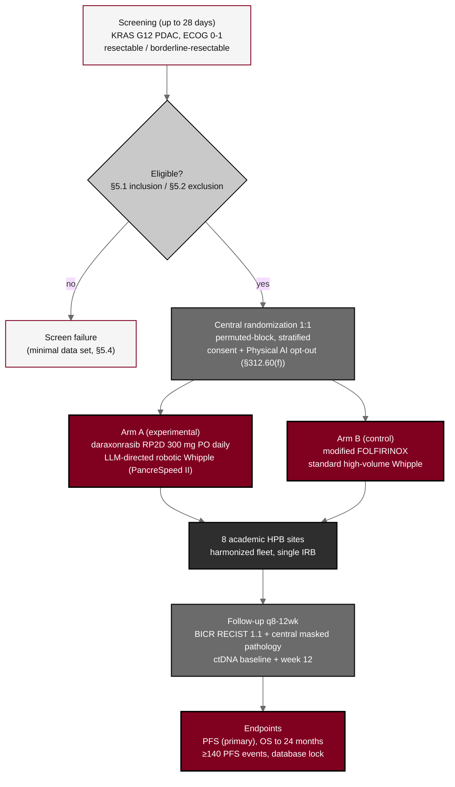

## Figure 1. Overall randomized multicenter trial schema

**Caption.** End-to-end schema for the Phase 2 multicenter randomized study, from 28-day screening through eligibility determination, central 1:1 stratified randomization with the Physical AI consent opt-out, the two parallel arms (Arm A daraxonrasib at the RP2D plus the LLM-directed robotic Whipple; Arm B modified FOLFIRINOX plus standard Whipple), conduct across eight harmonized HPB sites, follow-up with blinded independent central review, and the progression-free-survival and 24-month overall-survival endpoints, including the screen-failure branch.

**Role in the protocol.** Renders as the &sect;1.2 Schema and orients the Synopsis; becomes a TikZ `mermaidfig` in the draft, full, and final stages.

**Source files.** `sections/sec-01-summary.tex` (synopsis, schema, arms, sample size); `sections/sec-04-design.tex` (randomization, eight-site design, BICR).
