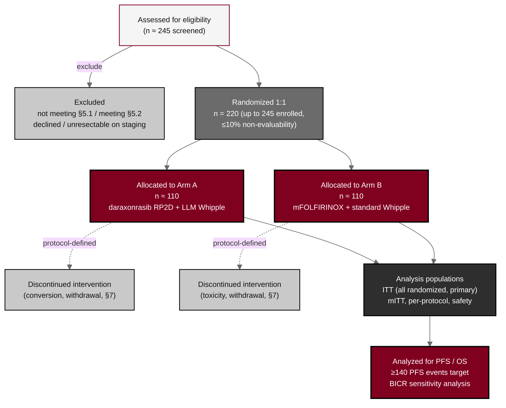

## Figure 2. CONSORT randomized participant flow

**Caption.** CONSORT-style participant flow for the parallel-group randomized design: approximately 245 participants are screened, approximately 220 are randomized 1:1 (up to 245 enrolled to allow up to 10 percent non-evaluability), allocating roughly 110 per arm to Arm A and Arm B, with protocol-defined discontinuation branches feeding into the intention-to-treat, modified intention-to-treat, per-protocol, and safety populations and the event-driven PFS and OS analysis.

**Role in the protocol.** Supports &sect;5 Study Population, &sect;9.2 Sample Size, and &sect;9.3 Populations for Analyses; the screened, randomized, and per-arm counts anchor the design.

**Source files.** `sections/sec-09-statistics.tex` (sample size, populations, evaluability); `sections/sec-04-design.tex` (randomized allocation, eight-site conduct).
