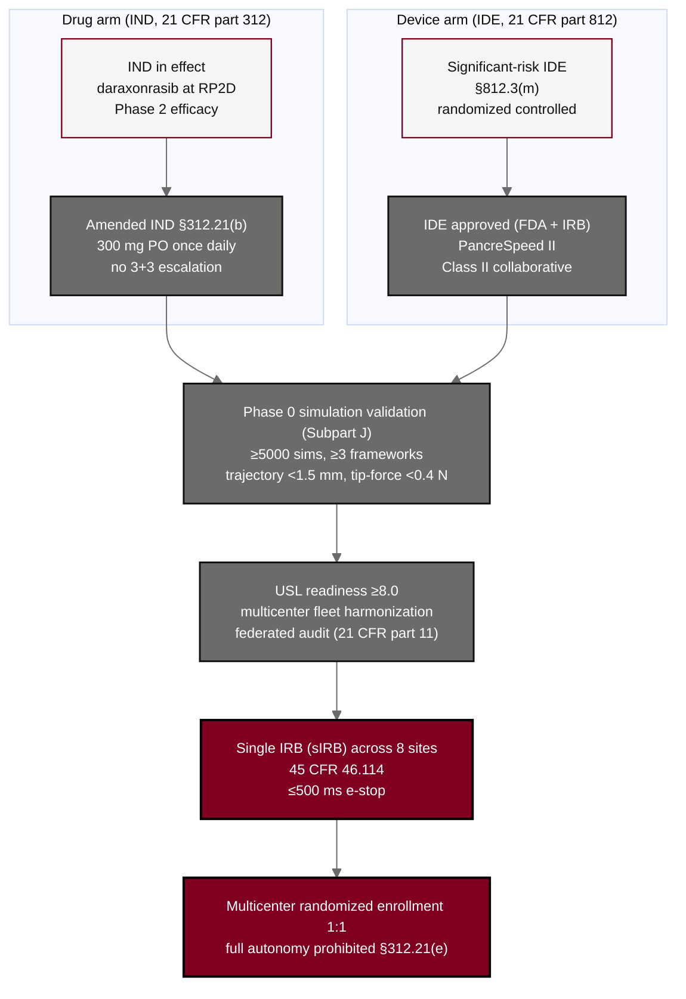

## Figure 3. Combined IND / IDE pathway with Subpart J overlay

**Caption.** Combined IND / IDE regulatory pathway with the upgraded Physical AI Subpart J overlay for Phase 2. The daraxonrasib drug arm (IND, part 312, at the established RP2D) and the robotic Whipple device arm (IDE, part 812, significant-risk per &sect;812.3(m), randomized controlled) converge through Phase 0 simulation validation across at least three frameworks, USL readiness &ge;8.0 with fleet harmonization, single IRB review across eight sites, and Class II collaborative classification into a single multicenter randomized enrollment pathway.

**Role in the protocol.** Renders the &sect;0 Statement of Compliance pathway; orients the drug, device, and overlay spines that govern the trial.

**Source files.** `sections/sec-00-compliance.tex` (IND/IDE/Subpart J, single IRB, USL &ge;8.0); `sections/sec-04-design.tex` (combined submission, Phase 0 gate).
