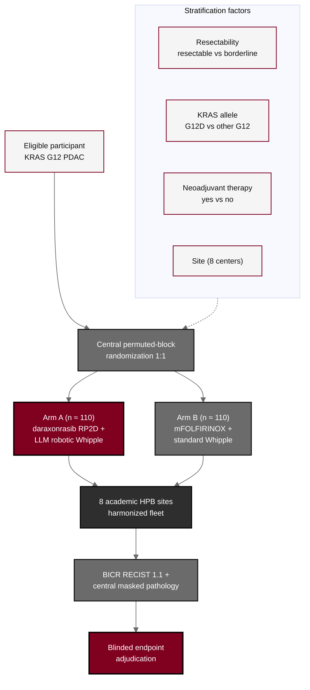

## Figure 4. Randomization and multicenter design

**Caption.** Randomization and multicenter design. Eligible participants undergo central permuted-block randomization 1:1, stratified by resectability, KRAS allele, neoadjuvant therapy, and site, to Arm A (daraxonrasib at the RP2D plus the LLM-directed robotic Whipple) or Arm B (modified FOLFIRINOX plus standard high-volume Whipple). Both arms are delivered across the eight academic HPB sites operating as a harmonized fleet, and all outcomes flow through blinded independent central review and central masked pathology into blinded endpoint adjudication.

**Role in the protocol.** Renders the &sect;4.1 Overall Design and &sect;6.5 measures-to-minimize-bias; the four strata and central mechanism control allocation bias.

**Source files.** `sections/sec-04-design.tex` (stratified randomization, BICR, adjudication); `sections/sec-06-intervention.tex` (central randomization, masked pathology).
