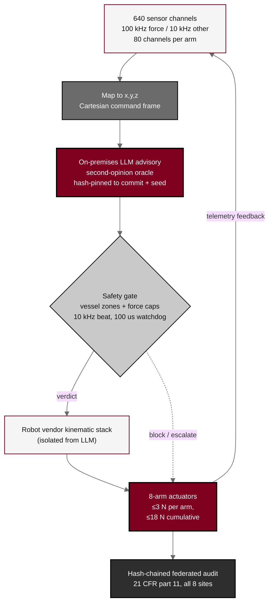

## Figure 5. On-premises LLM advisory control loop

**Caption.** On-premises LLM advisory control loop. Sensor data from the 640-channel stack is mapped to a Cartesian command frame; the LLM issues hash-pinned advisory commands from outside the vendor kinematic stack (second-opinion oracle isolation); and a safety gate enforces the vessel zones, the force caps, the 10 kHz heartbeat, and the 100 us watchdog before any actuator moves. Actuator telemetry returns to the sensor stack, and every step is written to a hash-chained federated audit trail under 21 CFR part 11 across all eight sites.

**Role in the protocol.** Renders the &sect;6.1.1 advisory control loop; establishes the bounded, isolated, auditable LLM design that answers the black-box concern.

**Source files.** `sections/sec-06-intervention.tex` (sensor stack, advisory loop, vendor isolation, audit); `sections/sec-11-additional.tex` (federated audit across sites).
