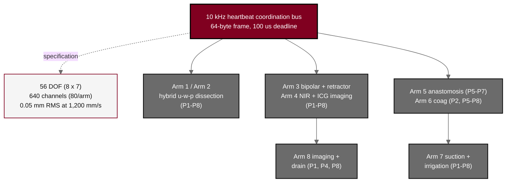

## Figure 6. Eight-arm platform architecture (PancreSpeed II)

**Caption.** Eight-arm platform architecture for PancreSpeed II. Eight cooperating arms (56 mechanical degrees of freedom as 8 by 7 per-arm, 640 sensor channels at 80 per arm, 0.05 mm root mean square positioning at a 1,200 mm/s peak tip velocity) are coordinated by a 10 kHz heartbeat bus broadcasting a 64-byte frame on a 100 us deadline; each arm's tool assignment and operative-phase coverage (P1 through P8) drive the Schedule of Activities.

**Role in the protocol.** Renders the &sect;6.1.1 device description and Table of per-arm tool assignment; defines the cyber-physical platform under test in Arm A.

**Source files.** `sections/sec-06-intervention.tex` (56 DOF, 640 channels, heartbeat bus, per-arm tools, phase coverage).
