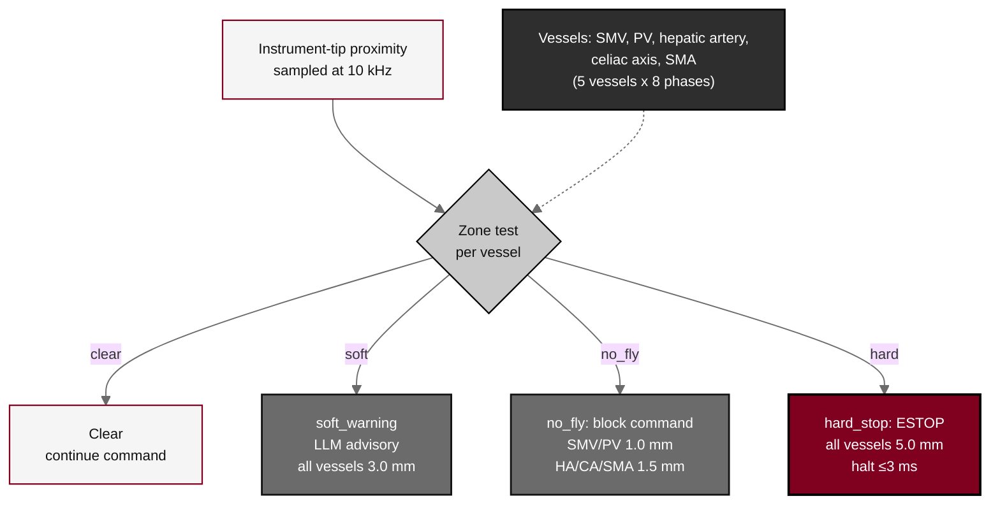

## Figure 7. Five-vessel vascular safety-zone gate

**Caption.** Five-vessel vascular safety-zone gate for Arm A. Three concentric proximity zones around each named vessel drive the response: a soft-warning zone (3.0 mm) raises an LLM advisory, a no-fly zone (1.0 mm at the superior mesenteric and portal veins; 1.5 mm at the hepatic artery, celiac axis, and superior mesenteric artery) blocks the command, and a hard-stop zone (5.0 mm) forces a &le;3 ms cross-arm E-stop. The gate is sampled at 10 kHz across all eight phases of the operation, and every verdict is written to the audit trail.

**Role in the protocol.** Renders the &sect;8.2 vascular safety-zone gate; defines the deterministic vessel-exclusion limits backing the significant-risk determination.

**Source files.** `sections/sec-08-assessments.tex` (five-vessel gate, three zones, 1.0/1.5/3.0/5.0 mm thresholds); `sections/sec-06-intervention.tex` (no-fly standoff distances).
