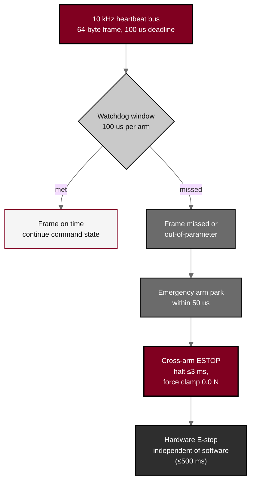

## Figure 8. Heartbeat, watchdog, and E-stop architecture

**Caption.** Heartbeat, watchdog, and E-stop architecture for Arm A. A 10 kHz heartbeat bus with a 100 us per-arm watchdog continues the command state on an on-time frame; a missed or out-of-parameter frame parks the affected arm within 50 us and escalates to a cross-arm E-stop that halts the platform in &le;3 ms at a 0.0 N force clamp, backed by a software-independent hardware E-stop meeting the &le;500 ms requirement.

**Role in the protocol.** Renders the &sect;8.2 halt-chain architecture; defines the layered cyber-physical stop budget that bounds every arm.

**Source files.** `sections/sec-08-assessments.tex` (heartbeat, watchdog, park, cross-arm E-stop, hardware E-stop); `sections/sec-06-intervention.tex` (50 us park, &le;3 ms / &le;500 ms latencies).
