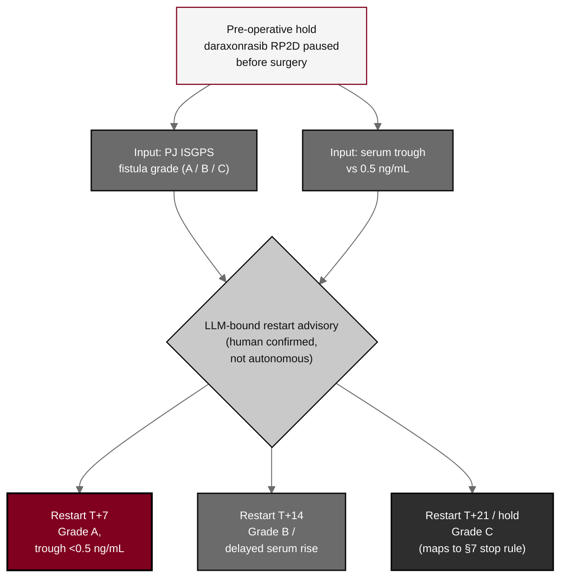

## Figure 9. Daraxonrasib perioperative pause-and-restart advisory

**Caption.** Daraxonrasib perioperative pause-and-restart advisory in Arm A at the established RP2D. The restart day is keyed to the pancreaticojejunostomy ISGPS fistula grade and the serum trough relative to 0.5 ng/mL: T+7 for Grade A with a sub-threshold trough, T+14 for Grade B or a delayed serum rise, and T+21 or continued hold for Grade C, which also maps to the &sect;7 drug stop rule. The advisory is LLM-bound and human-checked, never autonomous.

**Role in the protocol.** Renders the &sect;6.1.2 perioperative pause-and-restart advisory; the single drug-device coupling point in Arm A.

**Source files.** `sections/sec-06-intervention.tex` (pause-and-restart advisory, T+7/T+14/T+21, ISGPS grade, 0.5 ng/mL trough).
