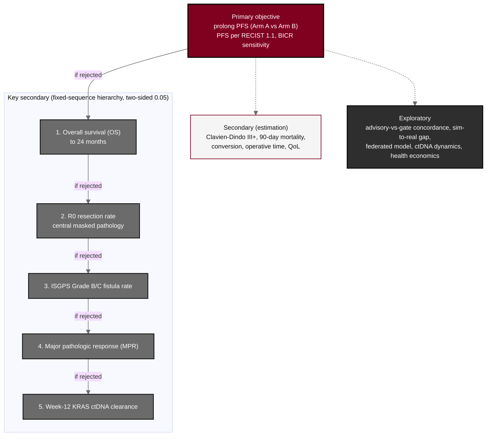

## Figure 10. Objectives-to-endpoints hierarchy

**Caption.** Objectives-to-endpoints hierarchy. The primary objective is to prolong progression-free survival in Arm A relative to Arm B (PFS per RECIST 1.1, investigator-assessed with BICR as a sensitivity analysis). The key secondary endpoints are tested only if the primary null is rejected, in a fixed-sequence hierarchy that controls the family-wise error at two-sided 0.05: overall survival, R0 resection rate, ISGPS Grade B/C fistula rate, major pathologic response, and week-12 KRAS ctDNA clearance, with the first non-rejection stopping the confirmatory sequence. Remaining secondary endpoints are estimation targets and exploratory analyses are non-confirmatory.

**Role in the protocol.** Renders the &sect;3 Objectives and Endpoints and the &sect;9.1 hypothesis hierarchy; defines the confirmatory testing order.

**Source files.** `sections/sec-09-statistics.tex` (primary PFS, fixed-sequence hierarchy, secondary and exploratory endpoints); `sections/sec-08-assessments.tex` (endpoint definitions).
