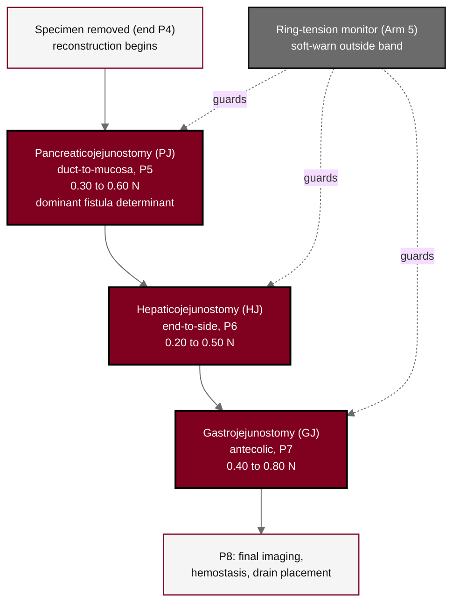

## Figure 11. Three reconstructive anastomoses and ring-tension bands

**Caption.** Three reconstructive anastomoses and their controller ring-tension bands, constructed in sequence under closed-loop Arm 5 control: the duct-to-mucosa pancreaticojejunostomy in P5 (0.30 to 0.60 N), the end-to-side hepaticojejunostomy in P6 (0.20 to 0.50 N), and the antecolic gastrojejunostomy in P7 (0.40 to 0.80 N), each guarded by the Arm 5 ring-tension monitor issuing a soft warning outside the band, followed by final imaging and drain placement in P8. The pancreaticojejunostomy is the dominant fistula determinant and supplies the fistula-grade input to the drug advisory.

**Role in the protocol.** Renders the &sect;6.1.2 reconstruction sequence and the &sect;8.1 anastomosis-quality assessment; ties device telemetry to the fistula endpoint.

**Source files.** `sections/sec-06-intervention.tex` (PJ/HJ/GJ sequence, ring-tension bands, Arm 5 soft-warn); `sections/sec-08-assessments.tex` (anastomosis-quality assessment).
