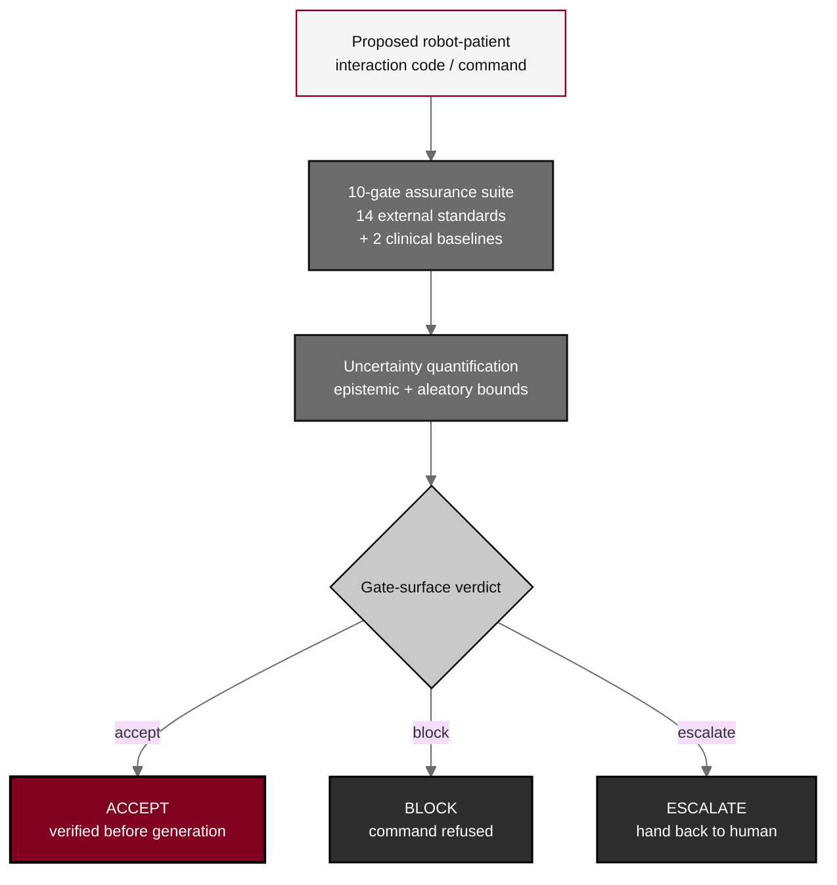

## Figure 12. Verification-before-generation ten-gate assurance

**Caption.** Verification before generation. Every proposed robot-patient command passes a ten-gate assurance suite aligned to fourteen external safety and robotics standards plus two clinical baselines, with epistemic and aleatory uncertainty bounds, before the gate surface returns one of ACCEPT (verified before generation), BLOCK (command refused), or ESCALATE (hand back to human). This operationalizes the technical half of the H.R. 9510 VVUQ standard.

**Role in the protocol.** Renders the &sect;11.1 ten-gate pipeline; the deny-by-default verification surface that constrains the LLM action space.

**Source files.** `sections/sec-11-additional.tex` (ten-gate suite, 14 standards + 2 baselines, ACCEPT/BLOCK/ESCALATE, VVUQ).
