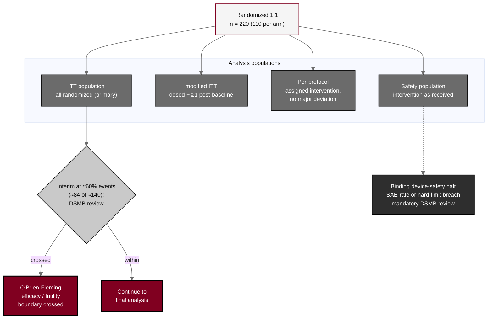

## Figure 13. Analysis populations and group-sequential interim

**Caption.** The four analysis populations (intention-to-treat, modified intention-to-treat, per-protocol, safety) and the single group-sequential interim analysis at approximately 60 percent of the targeted progression-free-survival events (approximately 84 of about 140), at which the DSMB evaluates the Lan-DeMets O'Brien-Fleming efficacy and futility boundaries. Binding device-safety halt rules operate in parallel: a device-related serious-adverse-event-rate breach or a hard-limit breach triggers a mandatory DSMB review and possible halt.

**Role in the protocol.** Renders the &sect;9.3 populations and &sect;9.4.6 interim analysis; defines the confirmatory stopping framework and the safety halt overlay.

**Source files.** `sections/sec-09-statistics.tex` (four populations, interim at 60%, O'Brien-Fleming, device-safety halt rules).
