## Figure 14. Schedule of Activities visit map

```mermaid
%%{init: {'theme':'base','themeVariables':{'fontSize':'12px','lineColor':'#6B6B6B'}}}%%
flowchart LR
    SCR["Screen<br/>Day -28 to -1<br/>consent + opt-out,<br/>KRAS G12, staging,<br/>BICR baseline imaging"]:::light
    RB["Rand / Baseline<br/>central 1:1 randomization,<br/>ctDNA baseline,<br/>Phase 0 sign-off USL &ge;8.0 (Arm A)"]:::mid
    SURG["Surgery Day 0<br/>robotic / standard Whipple,<br/>intra-op telemetry (Arm A)"]:::goal
    ACUTE["Acute Day 1-7<br/>ISGPS fistula grading,<br/>daraxonrasib restart advisory (Arm A)"]:::mid
    D30["Day 30<br/>primary safety window,<br/>ISGPS grading, labs, AE/SAE"]:::mid
    D90["Day 90<br/>central R0 / MPR pathology,<br/>ctDNA week 12, BICR imaging"]:::mid
    LT["Long-term q8-12wk<br/>BICR imaging, PFS / OS<br/>to 24-month OS endpoint"]:::goal
    SCR --> RB --> SURG --> ACUTE --> D30 --> D90 --> LT
    classDef goal fill:#800020,stroke:#000000,stroke-width:2px,color:#FFFFFF;
    classDef dark fill:#2E2E2E,stroke:#000000,stroke-width:1.5px,color:#FFFFFF;
    classDef mid fill:#6B6B6B,stroke:#111111,stroke-width:1.5px,color:#FFFFFF;
    classDef warn fill:#C9C9C9,stroke:#000000,stroke-width:1.2px,color:#111111;
    classDef light fill:#F5F5F5,stroke:#800020,stroke-width:1.2px,color:#111111;
```

**Caption.** Schedule of Activities visit map for both arms, binding each assessment to a timepoint across the screening window (Day -28 to -1), randomization and baseline, surgery (Day 0), the acute window (Day 1 to 7), Day 30 (primary safety window), Day 90 (central R0 and MPR pathology), and long-term follow-up every 8 to 12 weeks to the 24-month overall-survival endpoint. ctDNA (KRAS) is drawn at baseline and week 12 in both arms; the Phase 0 sign-off with USL &ge;8.0, the intra-operative telemetry capture, and the daraxonrasib restart advisory are arm-flagged to Arm A.

**Role in the protocol.** Renders the &sect;1.3 Schedule of Activities; orients every assessment to its visit across both arms.

**Source files.** `sections/sec-01-summary.tex` (Schedule of Activities table, visit windows, ctDNA baseline + week 12, arm-flagged rows).
