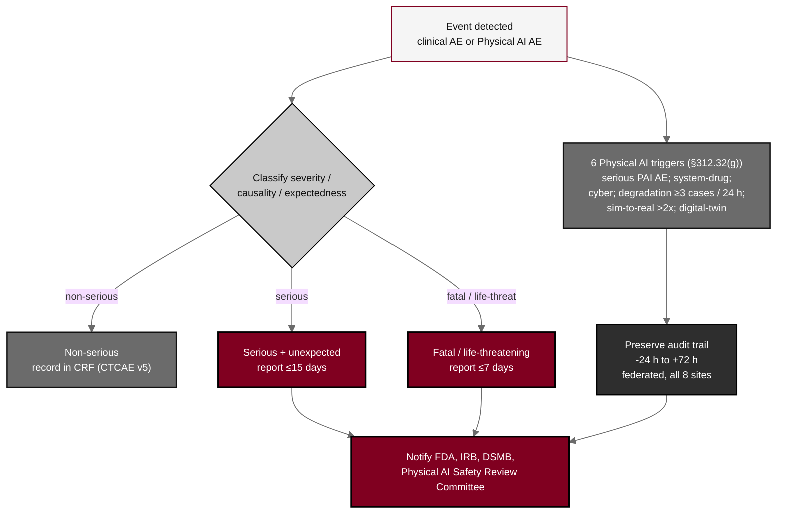

## Figure 15. Adverse-event and Physical AI AE reporting workflow

**Caption.** Adverse-event and Physical AI AE reporting workflow. Clinical events in both arms are graded by CTCAE v5 and reported on the 15-day (serious, unexpected) or 7-day (fatal, life-threatening) IND/IDE timelines, while six Physical AI triggers under &sect;312.32(g) add their own reports (serious Physical AI AE; system-drug interaction; cybersecurity incident; sustained model degradation over three or more procedures or 24 hours; sim-to-real divergence beyond twice tolerance; digital-twin discrepancy), each preserving the hash-chained audit trail from 24 hours before to 72 hours after the event, federated across the eight sites, with notification to the FDA, the IRB, the DSMB, and the Physical AI Safety Review Committee.

**Role in the protocol.** Renders the &sect;8.3 AE/SAE machinery and the &sect;8.3.6 Physical AI reporting triggers.

**Source files.** `sections/sec-08-assessments.tex` (AE/Physical AI AE streams, 7/15-day timelines, six triggers, -24h to +72h audit preservation).
