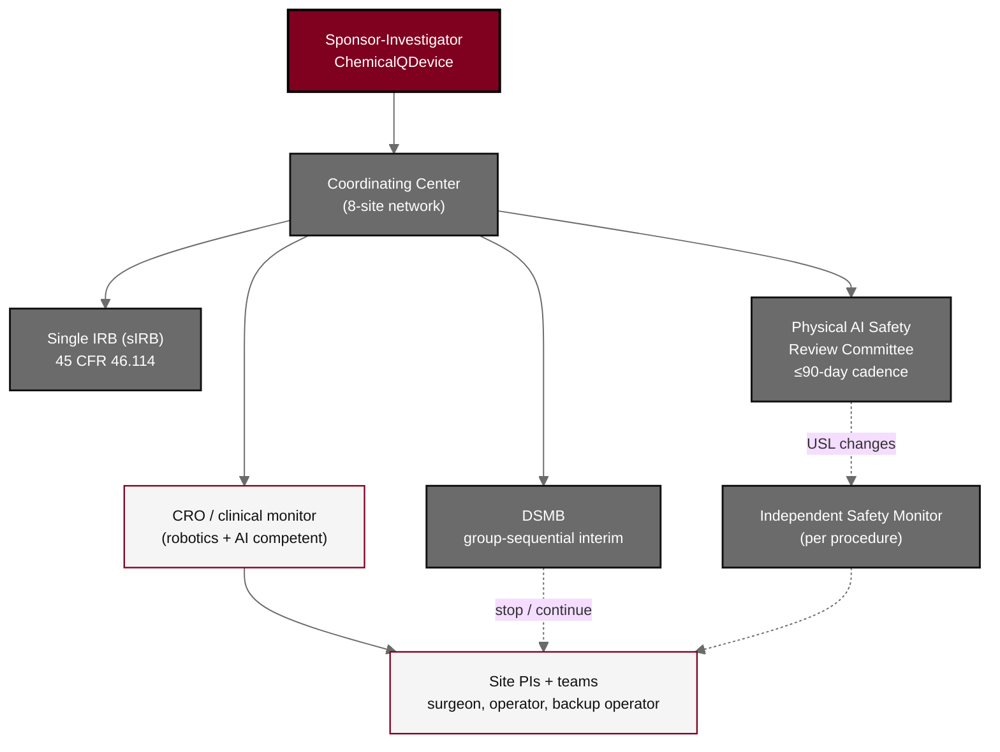

## Figure 16. Multicenter governance and safety oversight

**Caption.** Multicenter governance and safety oversight. The Sponsor-Investigator directs the trial through a Coordinating Center across the eight-site network and answers to a single IRB and an independent DSMB with a group-sequential interim plan, convenes a Physical AI Safety Review Committee on a &le;90-day cadence, designates an Independent Safety Monitor for each procedure, and delegates monitoring to a robotics- and AI-competent CRO over the site Principal Investigators and their teams (surgeon, operator, and backup operator).

**Role in the protocol.** Renders the &sect;10 governance structure and &sect;10.9 safety oversight; defines the three independent oversight tiers.

**Source files.** `sections/sec-10-oversight.tex` (Coordinating Center, sIRB, DSMB, Physical AI Safety Review Committee, ISM, CRO, site PIs).
