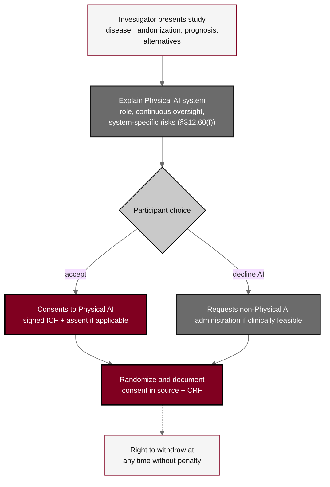

## Figure 17. Informed-consent process with Physical AI opt-out

**Caption.** Informed-consent process with the Physical AI opt-out. Consent discloses the randomized allocation, the open-label nature, the risks of each regimen, and the Physical AI system's role, continuous human oversight, and system-specific risks, and offers a participant randomized to Arm A a documented right to request non-Physical AI administration where clinically feasible under 21 CFR &sect;312.60(f), with the standard right to withdraw at any time without penalty. The election or declination is recorded in the source document and the case report form before randomization.

**Role in the protocol.** Renders the &sect;10.1 Informed Consent Process and the documented Physical AI opt-out.

**Source files.** `sections/sec-10-oversight.tex` (consent process, Physical AI opt-out &sect;312.60(f), randomize and document, withdrawal right).
