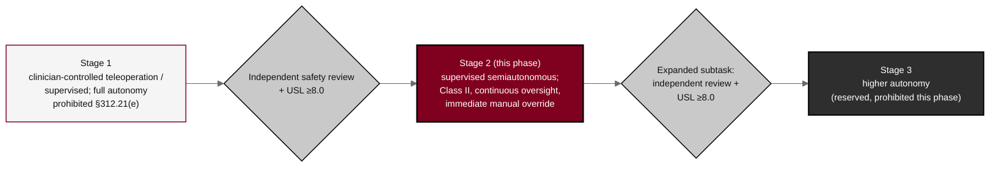

## Figure 18. Phase-graduated staged-autonomy model

**Caption.** Phase-graduated staged-autonomy model for Phase 2. The operative system runs at Stage 2 supervised semiautonomy (Class II, continuous oversight with immediate manual override). Movement from clinician-controlled Stage 1 to Stage 2, and any expanded supervised-autonomous subtask, requires an independent safety review and a Unified Safety Level of at least 8.0; full autonomy (Stage 3) remains reserved and prohibited at this phase under 21 CFR &sect;312.21(e).

**Role in the protocol.** Renders the &sect;4.3 staged-autonomy model; defines the autonomy ceiling and the USL gate for any escalation.

**Source files.** `sections/sec-04-design.tex` (Stage 1 to Stage 2 to Stage 3, USL &ge;8.0, full autonomy prohibited &sect;312.21(e)); `sections/sec-00-compliance.tex` (Class II, supervised semiautonomy).
