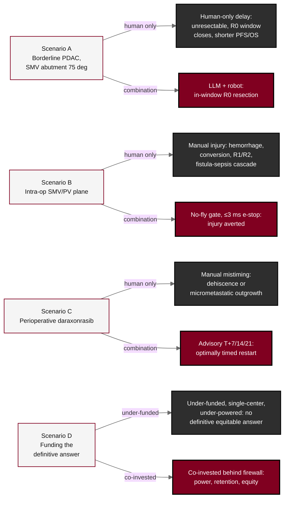

## Figure 19. Four counterfactual scenarios

**Caption.** The four counterfactual scenarios in which withholding the integrated approach worsens the patient or the evidence. Scenario A: a human-only scheduling delay lets a borderline-resectable tumor abutting the superior mesenteric vein progress and closes the R0 window, while the LLM-directed robot achieves an in-window R0 resection. Scenario B: an unrecognized superior-mesenteric or portal-vein injury during manual surgery triggers the fistula-sepsis cascade, while the no-fly gate with a &le;3 ms emergency stop averts it. Scenario C: manual mistiming of the daraxonrasib restart causes dehiscence or micrometastatic outgrowth, while the timed advisory at T+7, T+14, or T+21 prevents it. Scenario D: an under-funded, single-center, under-powered study yields no definitive equitable answer, while patient-aligned co-investment walled off by the capital firewall converts capital into accrual speed, retention, fidelity, and statistical power.

**Role in the protocol.** Renders the &sect;2.1 Study Rationale counterfactuals; motivates the combination and the co-investment model.

**Source files.** `sections/sec-02-introduction.tex` (four counterfactual scenarios A-D, SMV abutment, no-fly gate, advisory timing, capital firewall).
