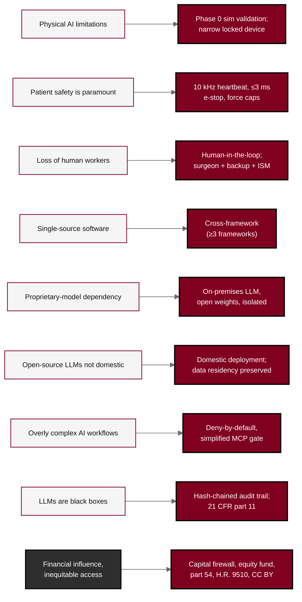

## Figure 20. Nine Physical AI concerns and their mitigations

**Caption.** The mapping of all nine Physical AI concerns to protocol mitigations. The original eight device concerns are paired with validated device behavior over open-endedness, layered hard safety limits, retained human roles, multi-framework non-single-source validation, on-premises open-weight isolation, domestic deployment, a deny-by-default simplified gate surface, and a hash-chained audit trail under 21 CFR part 11; the ninth, financial influence and inequitable access, new to this Phase 2 design, is answered by the capital firewall, the Patient Access and Equity Fund, 21 CFR part 54 disclosure, the H.R. 9510 VVUQ financial standard, and open CC BY deposition.

**Role in the protocol.** Renders the &sect;2.2 Physical AI concerns mapping and the companion table; the ninth concern is unique to Phase 2.

**Source files.** `sections/sec-02-introduction.tex` (nine concerns and mitigations table, financial-influence concern, capital firewall and equity fund).
