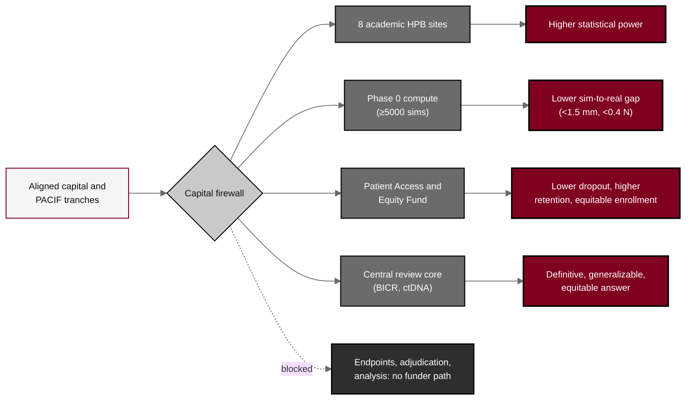

## Figure 21. Co-investment-to-success-likelihood pathway

**Caption.** The co-investment-to-success-likelihood pathway. Aligned capital and the PACIF flow only through the capital firewall into operational levers (eight sites, Phase 0 compute, the Patient Access and Equity Fund, and the central review and biomarker core), which raise statistical power, lower the sim-to-real gap (below 1.5 mm and 0.4 N), lower dropout and raise retention and equitable enrollment, and so raise the probability of a definitive, generalizable, equitable answer. The dashed blocked edge shows that the firewall admits no path from funders to the endpoints, their adjudication, or the analysis: capital raises operational success likelihood while the integrity of the result is structurally protected.

**Role in the protocol.** Renders the &sect;2.3 co-investment logic; shows how capital becomes power, fidelity, retention, equity, and generalizability without buying the answer.

**Source files.** `sections/sec-02-introduction.tex` (co-investment tranches, six operational levers, firewall, success-likelihood outcomes).
