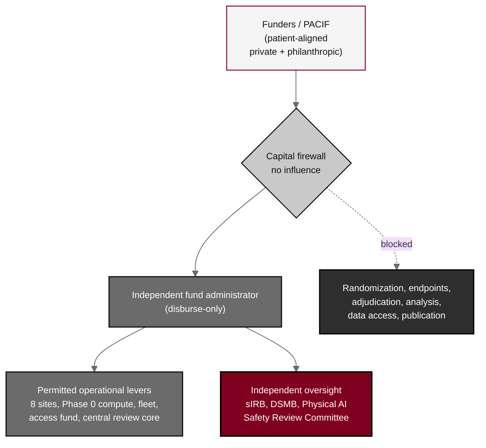

## Figure 22. Capital firewall governance

**Caption.** Capital firewall governance. Patient-aligned funders contribute through the PACIF into an independent fund administrator behind a capital firewall that disburses only to the permitted operational levers (the eight-site network, Phase 0 compute, the robot fleet, the Patient Access and Equity Fund, and the central review and biomarker core) and to independent oversight; the dashed blocked path shows that funders cannot reach randomization, endpoint definition, outcome adjudication, statistical analysis, data access, or publication. Financial interests are disclosed under 21 CFR part 54 and governed by the H.R. 9510 VVUQ financial-data standard.

**Role in the protocol.** Renders the &sect;10.3 Funding, Co-Investment Governance, and the Capital Firewall.

**Source files.** `sections/sec-10-oversight.tex` (PACIF, capital firewall, fund administrator, permitted levers, independent oversight, blocked science); `sections/sec-00-compliance.tex` (part 54, H.R. 9510).
