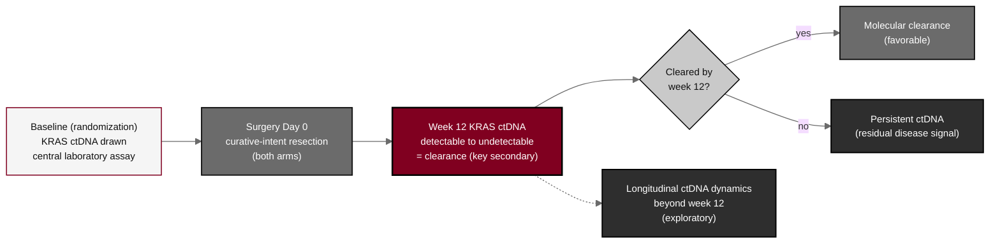

## Figure 23. ctDNA KRAS clearance monitoring timeline

**Caption.** Circulating tumor DNA KRAS clearance monitoring timeline. KRAS ctDNA bearing the participant's mutation is measured by a central laboratory at baseline (randomization) in both arms; the conversion from a detectable to an undetectable KRAS ctDNA level by week 12 is the week-12 molecular-clearance key secondary endpoint, tested in the confirmatory hierarchy. The longitudinal dynamics of KRAS ctDNA beyond the week-12 clearance endpoint are an exploratory, non-confirmatory analysis.

**Role in the protocol.** Renders the &sect;8.1 ctDNA assessment, the &sect;9.1 key secondary endpoint, and the &sect;9.4.10 exploratory dynamics.

**Source files.** `sections/sec-08-assessments.tex` (ctDNA baseline + week-12 clearance); `sections/sec-09-statistics.tex` (key secondary clearance, exploratory ctDNA dynamics); `sections/sec-01-summary.tex` (ctDNA draw timing).
