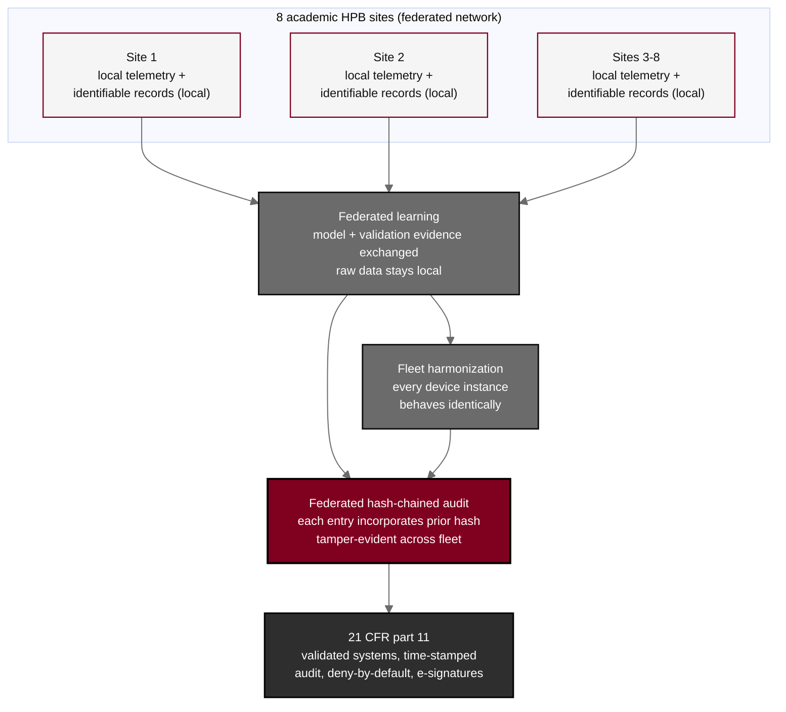

## Figure 24. Federated learning and hash-chained audit across sites

**Caption.** Federated learning and federated hash-chained audit across the eight sites. The academic HPB centers operate as a federated network: model and validation evidence is exchanged across sites while raw telemetry and identifiable records remain local, fleet harmonization ensures every device instance behaves identically, and the audit trail is hash-chained across the fleet so that each entry cryptographically incorporates the hash of the prior entry and any alteration is detectable. The whole record is maintained under 21 CFR part 11 with validated systems, secure time-stamped audit trails, a deny-by-default authorization model, and electronic signatures bound to the records they authenticate.

**Role in the protocol.** Renders the &sect;11.1 federated network and the &sect;10.6 confidentiality and &sect;10.10 data-handling controls.

**Source files.** `sections/sec-11-additional.tex` (federated network, model exchange, fleet harmonization, hash-chained audit); `sections/sec-10-oversight.tex` (21 CFR part 11, deny-by-default, tamper-evident chain).
