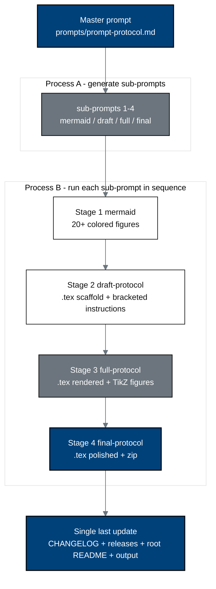

# trial-protocol - Physical AI Pancreatic Whipple + Daraxonrasib Phase 1 Clinical Trial Protocol (v4.0.0)

[](https://creativecommons.org/licenses/by/4.0/)
[](.)
[](.)
[](nih-protocol)
[](.)
[](mermaid)
[](https://doi.org/10.5281/zenodo.xxxxxxxx)
[](../releases.md)

This directory holds the autonomous, single-prompt build of a new **Phase 1,
First-in-Human, Combined IND/IDE Clinical Trial Protocol** for **on-premises
large language model (LLM) directed robotic pancreaticoduodenectomy (the Whipple
procedure) with perioperative daraxonrasib (RMC-6236)** in patients with
KRAS-mutated pancreatic ductal adenocarcinoma (PDAC). The build is driven by the
single master prompt in [`prompts/prompt-protocol.md`](prompts/prompt-protocol.md):
**Process A** generated every sub-prompt under [`sub-prompts/`](sub-prompts), and
**Process B** runs those sub-prompts in order, growing the protocol from Mermaid
figures to a draft, a full, and a final LaTeX protocol. Every distinguishable
file is a separate commit pushed in real time; all milestones are tracked in one
continuously updated pull request (Rules 6, 7, 8).

- **Author:** Kevin Kawchak, CEO ChemicalQDevice
  ([ORCID 0009-0007-5457-8667](https://orcid.org/0009-0007-5457-8667))
- **DOI:** [`10.5281/zenodo.xxxxxxxx`](https://doi.org/10.5281/zenodo.xxxxxxxx)
  (pending deposit) - **Date:** June 20, 2026 - **Version:** v4.0.0

## What this protocol is

It is the first substantial **Physical AI clinical trial protocol**: prior AI in
trials was limited to prediction or narrow utility, whereas this protocol places
a state-of-the-art LLM-plus-robot-plus-medicine combination at the center of a
curative-intent oncology operation, for advanced patients in whom the benefit of
new technology outweighs its risk. The daraxonrasib drug arm proceeds under an
IND (21 CFR part 312, Phase 1, 3+3 dose escalation); the eight-arm robotic
Whipple system proceeds as a significant-risk device under an IDE (21 CFR part
812) with the Physical AI overlay of Subpart J; the two are combined in one
first-in-human protocol.

## Build pipeline (Corporate Blue / Professional Gray Mermaid)



## Milestone schedule (one pull request, updated as each lands)

**Status: complete (v4.0.0).** All milestones landed on
`claude/gallant-planck-auv8n0`, one commit per file pushed in real time, inside
one continuously updated pull request.

| Milestone | Stage | Output directory | Commits | Status |
|:--|:--|:--|:--|:--|
| M1 | Bootstrap (Process A) | `prompts/`, `sub-prompts/`, this README, directory READMEs, template recolor | per file | complete |
| M2 | Stage 1 mermaid | [`mermaid/`](mermaid) | 28 (25 figures) | complete |
| M3 | Stage 2 draft-protocol | [`draft-protocol/`](draft-protocol) | 21 | complete |
| M4 | Stage 3 full-protocol | [`full-protocol/`](full-protocol) | 21 (20 TikZ, 11 tables) | complete |
| M5 | Stage 4 final-protocol | [`final-protocol/`](final-protocol) | 21 | complete |
| M6 | Release (v4.0.0) | root `CHANGELOG.md`, `releases.md`, `README.md`, `prompts/output-protocol.md` | 5+ | complete |

## Directory map

```
trial-protocol/
  README.md                 (this build hub)
  prompts/                  prompt-protocol.md (master, verbatim) + output-protocol.md
  sub-prompts/              prompt-1-mermaid .. prompt-4-final-protocol (Process A)
  mermaid/        (Stage 1) 20+ colored Mermaid figure files + README + output
  draft-protocol/ (Stage 2) main.tex, protostyle.sty, references.bib, sections/, zip
  full-protocol/  (Stage 3) same set, fully rendered
  final-protocol/ (Stage 4) same set, polished (no publication subdirectory)
  template/                 paper template (recolored to #00417A)
  nih-protocol/             NIH-FDA IND/IDE protocol template (10 chunks)
  inputs/                   main documents 1-3 + author_works.bib
  research/                 dated 2026 background markdowns
```

## The NIH protocol sections addressed (each a `sections/*.tex`, Rule 6)

Statement of Compliance; Protocol Summary (Synopsis, Schema, Schedule of
Activities); Introduction (Rationale, Background, Risk/Benefit); Objectives and
Endpoints; Study Design; Study Population; Study Intervention; Intervention and
Participant Discontinuation/Withdrawal; Study Assessments and Procedures;
Statistical Considerations; Regulatory, Ethical, and Oversight Considerations;
Additional Considerations, Abbreviations, and Amendment History; References and
Back Matter.

## Color scheme (Rule for Mermaid figures)

| Role | Color | Hex |
|:--|:--|:--|
| End goals, investigational system, operative decisions | Corporate Blue | `#00417A` |
| Process and oversight nodes | Professional Gray | `#6C757D` |
| Inputs and context | Classic White | `#FFFFFF` |
| Rules, secondary fills | Black / grayscale | `#000000` and grays |

## Sources used (Rule 5)

| Source | Supplies |
|:--|:--|
| [`inputs/2030-pdac-1min-final-paper`](inputs/2030-pdac-1min-final-paper) | Clinical subject, robot platform, all quantitative data and tables |
| [`inputs/21cfr312_adapt`](inputs/21cfr312_adapt) | Physical AI IND overlay (Subpart J, USL thresholds, AE reporting) |
| [`inputs/auto-bill-02`](inputs/auto-bill-02) | VVUQ legislative/financial framing; the build workflow and LaTeX conventions |
| [`inputs/author_works.bib`](inputs/author_works.bib) | 43 author works evidencing LLM trust (Aug 2024 - Jun 2026) |
| [`research/`](research) | 2026 Physical AI FDA-approval and oncology-strategy background |
| [`nih-protocol/`](nih-protocol) | The NIH-FDA IND/IDE protocol template that governs section order |
| [`template/`](template) | The single-column paper template (recolored `#00417A`) |

## License

Released under CC BY 4.0; reproduced U.S. Government regulatory text is used
under 17 U.S.C. § 105. Author: Kevin Kawchak, CEO ChemicalQDevice.

*Independent research draft. Not an enacted protocol, not an active IND or IDE,
and not medical or regulatory advice; not endorsed by the FDA, NIH, HHS, IRB,
ICH, or any sponsor. The DOI placeholder `10.5281/zenodo.xxxxxxxx` is filled at
deposit. All clinical figures derive from the author's simulation sources and
are illustrative unless tied to a cited reference.*
