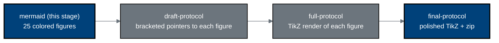

# mermaid - Stage 1 figure catalog (v1.0.0)

[](https://creativecommons.org/licenses/by/4.0/)
[](.)
[](.)
[](.)
[](../sub-prompts/prompt-1-mermaid.md)

This directory is the output of **Stage 1** (sub-prompt
[`../sub-prompts/prompt-1-mermaid.md`](../sub-prompts/prompt-1-mermaid.md)): a
catalog of **25 new, comprehensive Mermaid figures** for the Phase 1 robotic
Whipple plus daraxonrasib protocol. Each file opens with a real ```mermaid```
block that renders natively in GitHub and is later reproduced as an identical
gray-scale / blue-accent TikZ `mermaidfig` in the draft, full, and final LaTeX
stages, carrying the same complexity and the same quantitative content. None
reuse any prior author figure.

## Color scheme

| Role | Color | Hex | `classDef` |
|:--|:--|:--|:--|
| End goals, investigational system, operative decisions | Corporate Blue | `#00417A` | `goal` |
| Process, oversight, and intermediate nodes | Professional Gray | `#6C757D` | `mid` |
| Inputs and context | Classic White | `#FFFFFF` | `light` |
| Rules, raw data, audit | Black / grayscale | `#222222`, `#D9D9D9` | `dark`, `warn` |

## Figure inventory (Rule 5: source files named)

| # | File | Title | Primary source files |
|:--|:--|:--|:--|
| 1 | `fig-01-trial-schema.md` | Overall trial schema | 2030-pdac methods/intro; 21cfr312 phases |
| 2 | `fig-02-consort-flow.md` | CONSORT participant flow | nih-protocol 03/07; research 19Jun |
| 3 | `fig-03-ind-ide-pathway.md` | Combined IND/IDE pathway | 21cfr312 01/02/05; research 19Jun |
| 4 | `fig-04-llm-advisory-loop.md` | On-premises LLM advisory loop | 2030-pdac intro/methods/discussion; 21cfr312 01 |
| 5 | `fig-05-platform-architecture.md` | Eight-arm platform architecture | 2030-pdac methods; 21cfr312 02 |
| 6 | `fig-06-intraoperative-timeline.md` | Eight-phase intraoperative timeline | 2030-pdac README/methods |
| 7 | `fig-07-vascular-safety-gate.md` | Five-vessel vascular safety gate | 2030-pdac methods; 21cfr312 05 |
| 8 | `fig-08-estop-architecture.md` | Heartbeat / watchdog / E-stop | 2030-pdac methods; 21cfr312 05 |
| 9 | `fig-09-daraxonrasib-advisory.md` | Daraxonrasib pause-and-restart | 2030-pdac results; DARAXONRASIB cites |
| 10 | `fig-10-dose-escalation.md` | Daraxonrasib 3+3 escalation | nih-protocol 04; 2030-pdac intro |
| 11 | `fig-11-three-anastomoses.md` | Three anastomoses + ring tensions | 2030-pdac methods |
| 12 | `fig-12-vvuq-ten-gate.md` | VVUQ ten-gate assurance | research 19Jun; auto-bill-02 |
| 13 | `fig-13-objectives-endpoints.md` | Objectives-to-endpoints hierarchy | nih-protocol 02; research 19Jun |
| 14 | `fig-14-schedule-of-activities.md` | Schedule of Activities visit map | nih-protocol 01; research 19Jun |
| 15 | `fig-15-ae-reporting.md` | AE / Physical AI AE reporting | 21cfr312 03; nih-protocol 06 |
| 16 | `fig-16-governance-oversight.md` | Governance and safety oversight | 21cfr312 03/04; nih-protocol 08/10 |
| 17 | `fig-17-informed-consent.md` | Informed consent + Physical AI opt-out | 21cfr312 05; nih-protocol 08 |
| 18 | `fig-18-staged-autonomy.md` | Staged autonomy model | 21cfr312 02; research 19Jun |
| 19 | `fig-19-counterfactual-scenarios.md` | Three PFS/OS counterfactual scenarios | 2030-pdac intro/discussion; research 19Jun |
| 20 | `fig-20-physical-ai-concerns.md` | Eight Physical AI concerns + mitigations | research 18Jun; 21cfr312 01; author_works |
| 21 | `fig-21-audit-trail-dataflow.md` | Hash-chained audit trail / data flow | 21cfr312 01; research 19Jun |
| 22 | `fig-22-analysis-populations.md` | Analysis populations + interim stopping | nih-protocol 07; research 19Jun |
| 23 | `fig-23-author-trust-timeline.md` | Author-works LLM-trust timeline | author_works.bib |
| 24 | `fig-24-risk-benefit-terminal.md` | Risk-benefit for advanced PDAC | 2030-pdac intro; research 19Jun; 21cfr312 02 |
| 25 | `fig-25-sensor-data-pyramid.md` | Sensor-data pyramid + retention | 2030-pdac results/limitations; 21cfr312 04 |

## How these figures translate to LaTeX

The five `classDef` roles map one-to-one onto the TikZ node styles defined in
each stage's `protostyle.sty` (`mmgoal`, `mmstep`/`mmmid`, `mmin`, `mmdark`,
`mmwarn`), and every node, edge, and label is reproduced so the compiled figure
carries the same complexity as the Mermaid source. The full and final stages
additionally verify no text-box / arrow overlap, correct curved-arrow looseness,
and proper box spacing.

## Build pipeline



## License

Released under CC BY 4.0. Author: Kevin Kawchak, CEO ChemicalQDevice
([ORCID 0009-0007-5457-8667](https://orcid.org/0009-0007-5457-8667)).
