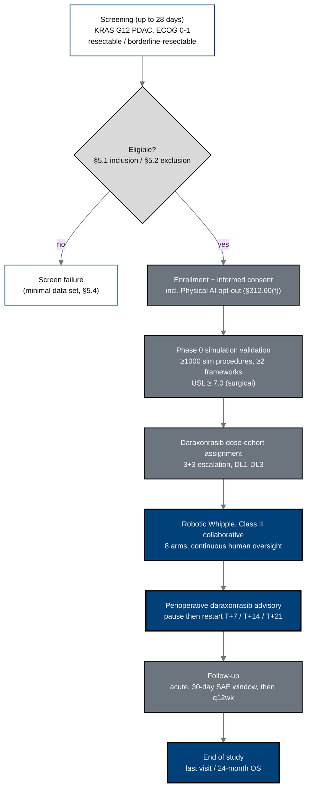

## Figure 1. Overall trial schema

**Caption.** End-to-end schema for the Phase 1 combined IND/IDE study, from
28-day screening through enrollment with the Physical AI consent opt-out, Phase 0
simulation validation, daraxonrasib 3+3 dose assignment, the eight-arm robotic
Whipple, the perioperative pause-and-restart advisory, and follow-up to the
24-month overall-survival endpoint.

**Role in the protocol.** Renders as the &sect;1.2 Schema and orients the Synopsis;
becomes a TikZ `mermaidfig` in the draft, full, and final stages.

**Source files.** `inputs/2030-pdac-1min-final-paper/sections/{introduction,methods}.tex`
(clinical subject, daraxonrasib advisory windows); `inputs/21cfr312_adapt/02_ind_content_phases.tex`
(Phase 0, USL &ge; 7.0); `research/ChatGPT-5.5-Thinking-Extended-19Jun26.md` (IDE feasibility framing).
