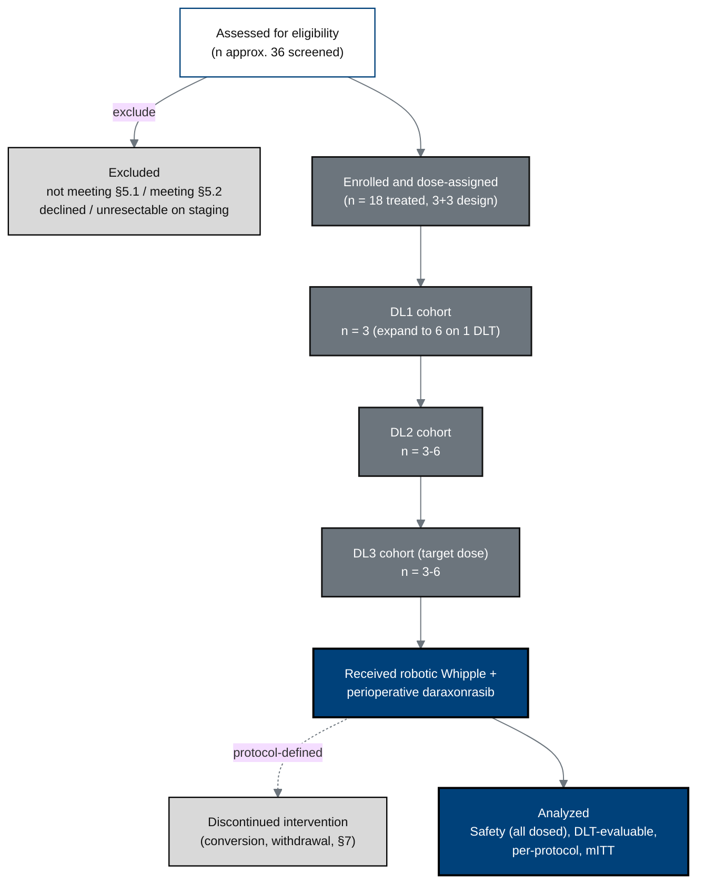

## Figure 2. CONSORT-style participant flow

**Caption.** Participant flow from screening through the 3+3 dose-escalation
cohorts (DL1-DL3, up to n = 18 treated) to the analysis populations, with the
exclusion and discontinuation branches that feed the per-protocol and safety
sets.

**Role in the protocol.** Supports &sect;5 Study Population and &sect;9.3
Populations for Analyses; the n and cohort sizes anchor &sect;9.2 sample size.

**Source files.** `nih-protocol/03_study_design_and_study_population.md` (CONSORT,
screen-failure set); `nih-protocol/07_statistical_considerations.md`
(analysis populations); `research/ChatGPT-5.5-Thinking-Extended-19Jun26.md`
(device-feasibility cohort sizing).
