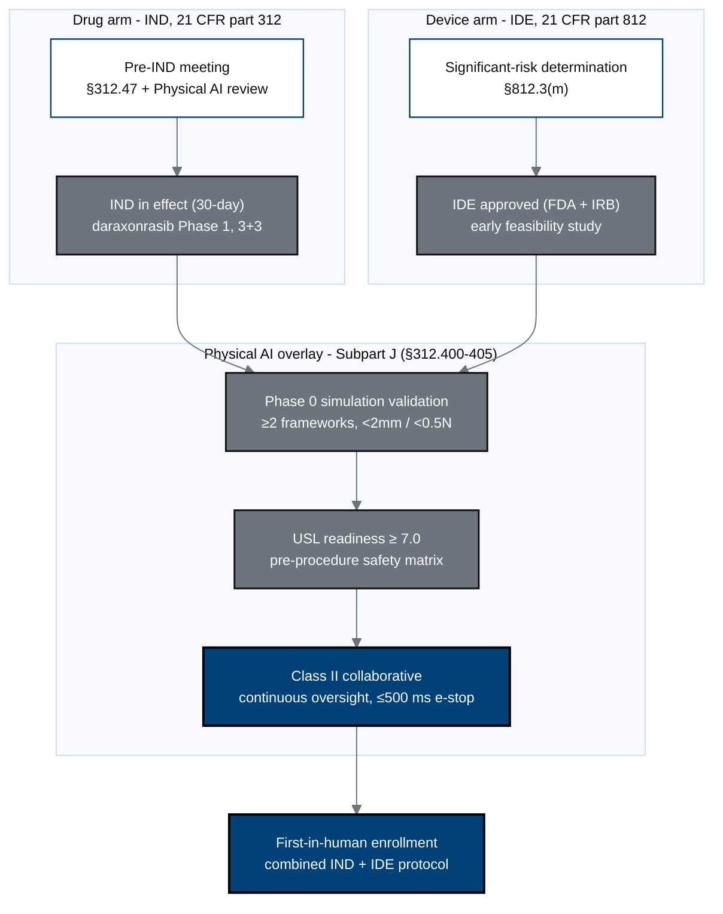

## Figure 3. Combined IND / IDE regulatory pathway with the Physical AI overlay

**Caption.** The daraxonrasib drug arm (IND, part 312) and the robotic Whipple
device arm (IDE, part 812, significant-risk) converge through the Physical AI
overlay of Subpart J - Phase 0 simulation validation, USL readiness, and Class II
collaborative classification - into one first-in-human protocol.

**Role in the protocol.** Renders in the Statement of Compliance and &sect;4 Study
Design; establishes the dual regulatory spine.

**Source files.** `inputs/21cfr312_adapt/{01_preamble_scope_definitions,02_ind_content_phases,05_clinical_holds_appendices_closing}.tex`
(Subpart J, USL thresholds, Phase 0); `research/ChatGPT-5.5-Thinking-Extended-19Jun26.md`
(significant-risk, early feasibility).
