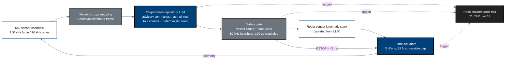

## Figure 4. On-premises LLM advisory control loop (second-opinion oracle isolation)

**Caption.** The on-premises LLM sits outside the robot vendor kinematic stack
(second-opinion oracle isolation): sensor data is mapped to x,y,z, the LLM issues
hash-pinned advisory commands, and a safety gate enforces vessel zones, force
caps, the 10 kHz heartbeat, and the &le;3 ms E-stop before any actuator moves.
Every step is logged to a 21 CFR part 11 hash-chained audit trail.

**Role in the protocol.** Core of &sect;6 Study Intervention and the patient-safety
argument; this loop is what minimizes single-robot error.

**Source files.** `inputs/2030-pdac-1min-final-paper/sections/{introduction,methods,discussion}.tex`
(on-premises LLM thesis, heartbeat/watchdog/E-stop, force caps);
`inputs/21cfr312_adapt/01_preamble_scope_definitions.tex` (hash-chained audit, deny-by-default).
