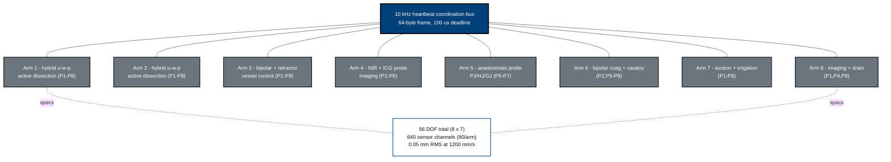

## Figure 5. Eight-arm PancreSpeed platform architecture

**Caption.** The eight cooperating arms (56 degrees of freedom, 640 sensor
channels, 0.05 mm RMS positioning at 1,200 mm/s) coordinated by a 10 kHz
heartbeat bus, with each arm's tool assignment and phase coverage.

**Role in the protocol.** Describes the investigational device in &sect;6.1.1 and
&sect;6.2; the per-arm tool/phase mapping drives the Schedule of Activities.

**Source files.** `inputs/2030-pdac-1min-final-paper/sections/methods.tex`
(per-arm tool assignment, sensor inventory, DOF, positioning);
`inputs/21cfr312_adapt/02_ind_content_phases.tex` (&sect;312.23(g) hardware specification).
