## Figure 6. Eight-phase intraoperative timeline

```mermaid
%%{init: {'theme':'base','themeVariables':{'fontSize':'12px','lineColor':'#6C757D'}}}%%
flowchart LR
    P1["P1 Kocher<br/>mobilization"]:::light
    P2["P2 vascular<br/>SMV/PV dissection"]:::mid
    P3["P3 uncinate<br/>artery-first SMA"]:::mid
    P4["P4 specimen<br/>removal"]:::mid
    P5["P5 PJ<br/>duct-to-mucosa"]:::goal
    P6["P6 HJ<br/>end-to-side"]:::goal
    P7["P7 GJ<br/>antecolic"]:::goal
    P8["P8 hemostasis<br/>+ drains"]:::mid
    P1 --> P2 --> P3 --> P4 --> P5 --> P6 --> P7 --> P8
    classDef goal fill:#00417A,stroke:#000000,stroke-width:2px,color:#FFFFFF
    classDef mid fill:#6C757D,stroke:#111111,stroke-width:1.5px,color:#FFFFFF
    classDef light fill:#FFFFFF,stroke:#00417A,stroke-width:1.2px,color:#111111
```

**Caption.** The eight operative phases of the robotic pancreaticoduodenectomy,
from Kocher mobilization (P1) through superior-mesenteric-vein and portal-vein
dissection (P2), the artery-first uncinate approach (P3), specimen removal (P4),
the three anastomoses (P5 pancreaticojejunostomy, P6 hepaticojejunostomy, P7
gastrojejunostomy), and hemostasis with drain placement (P8). In this Phase 1
protocol the phases proceed at conventional clinical tempo under continuous human
oversight; the compressed sixty-second target is reserved for a later phase.

**Role in the protocol.** Structures the &sect;6.1.2 operative description and the
intra-operative assessment timepoints in &sect;8.

**Source files.** `inputs/2030-pdac-1min-final-paper/README.md` and
`sections/methods.tex` (P1-P8 phase definitions and per-phase arm coverage).
