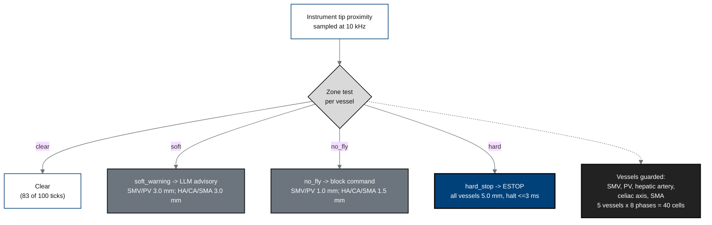

## Figure 7. Five-vessel vascular safety-zone gate

**Caption.** Three concentric proximity zones around each of five named vessels
(superior mesenteric vein, portal vein, hepatic artery, celiac axis, superior
mesenteric artery): a soft-warning zone triggers an LLM advisory, a no-fly zone
blocks the command, and a hard-stop zone forces a &le;3 ms E-stop. The gate is
sampled at 10 kHz across all 8 phases (40 vessel-by-phase cells).

**Role in the protocol.** A central &sect;6 / &sect;8 safety control and the
mechanism behind counterfactual Scenario B (vascular injury averted).

**Source files.** `inputs/2030-pdac-1min-final-paper/sections/methods.tex`
(vessel thresholds 1.0/1.5/3.0/5.0 mm, gate verdict counts);
`inputs/21cfr312_adapt/05_clinical_holds_appendices_closing.tex` (&sect;312.404 e-stop).
