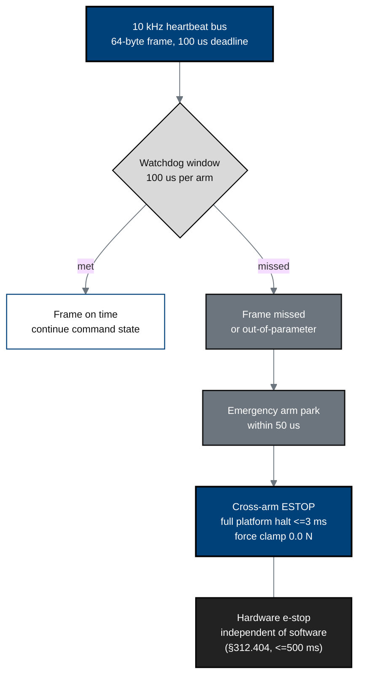

## Figure 8. Heartbeat, watchdog, and E-stop safety architecture

**Caption.** The layered halt chain: a 10 kHz heartbeat bus with a 100 us
per-arm watchdog; a missed frame parks the arm within 50 us and escalates to a
cross-arm E-stop that halts the platform in &le;3 ms at a 0.0 N force clamp,
backed by a software-independent hardware E-stop meeting the &sect;312.404
&le;500 ms requirement.

**Role in the protocol.** Operationalizes the &sect;6.3 / &sect;8.2 device safety
systems and the &sect;312.60 continuous-oversight requirement.

**Source files.** `inputs/2030-pdac-1min-final-paper/sections/methods.tex`
(heartbeat 10 kHz, watchdog 100 us, park 50 us, E-stop 3 ms);
`inputs/21cfr312_adapt/05_clinical_holds_appendices_closing.tex` (&sect;312.404 oversight, e-stop timing).
