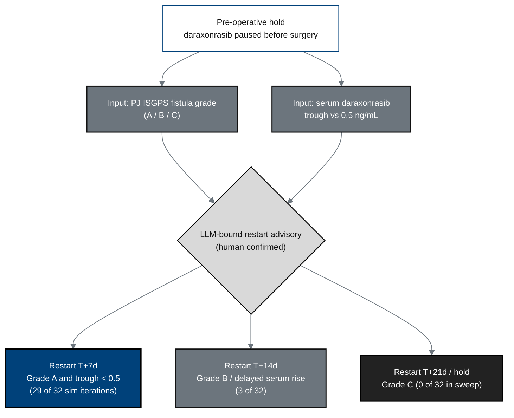

## Figure 9. Daraxonrasib perioperative pause-and-restart advisory

**Caption.** The perioperative advisory pauses daraxonrasib before surgery and
recommends a restart day keyed to the pancreaticojejunostomy ISGPS fistula grade
and the serum trough relative to 0.5 ng/mL: T+7d when the fistula is Grade A and
the trough is sub-threshold (29 of 32 simulation iterations), T+14d for Grade B
with delayed serum rise (3 of 32), and T+21d or continued hold for Grade C (0 of
32 in the sweep). The advisory is bound and human-confirmed, never autonomous.

**Role in the protocol.** Defines the &sect;6.1.2 dosing/restart logic and links
to counterfactual Scenario C (restart mistiming).

**Source files.** `inputs/2030-pdac-1min-final-paper/sections/results.tex`
(restart distribution table, 0.5 ng/mL trough, 29/3/0 of 32); `DARAXONRASIB`
citations in `prompts/prompt-protocol.md`.
